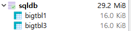

# 6.2.3 데이터의 삭제 : DELETE FROM

> UPDATE와 거의 비슷한 개념으로, DELETE는 행 단위로 삭제한다.


* 형식

  ```mariadb
  DELETE FROM 테이블 명 WHERE 조건;
  ```

  여기서 WHERE문을 생략하면 전체 데이터를 삭제한다.


* 예제 : 만약 `Aamer`가 `testtbl4`에 필요 없다면 다음과 같이 입력하면 된다.

  ```mariadb
  DELETE FROM TESTTBL4 WHERE FNAME = 'Aamer';
  ```

* 조건에 맞는 결과 중 상위 몇 건만 삭제할 때는 `LIMIT num` 을 입력하면 된다.

  ```mariadb
  DELETE FROM TESTTBL4 WHERE FNAME = 'Mary' LIMIT 5
  ```


* 실습

  1. 대용량 테이블을 3개 생성한다.

     ```mariadb
     USE SQLDB;
     CREATE TABLE bigTBL1 (SELECT * FROM employees.employees);
     CREATE TABLE bigTBL2 (SELECT * FROM employees.employees);
     CREATE TABLE bigTBL3 (SELECT * FROM employees.employees);
     ```

  2.  각각 DELETE/DROP/TRUNCATE문으로 세 테이블을 삭제한다. 세 구문 모두 테이블 행을 모두 삭제한다.

     ```mariadb
     DELETE FROM bigtbl1;
     DROP TABLE bigtbl2;
     TRUNCATE TABLE bigtbl3;
     ```

     * DELETE문은 **영향받은** **행**이 300,024로 나온다.

     * DROP문은 테이블 자체를 삭제한다. 따라서 영향 받은 행이 없다.

       

     * DML문인 DELETE는 트랜잭션 로그를 기록하는 작업 때문에 **영향받은** **행**이 표시된다.
     * DDL문은 트랜잭션을 발생시키지 않는다.
     * DDL문인 TRUNCATE문의 결과는 DELETE와 동일하지만, 트랜잭션 로그를 기록하지 않는다.

     ##### ※ MariaDB는 상관이 없지만 다른 DBMS에서는 3개의 트랜잭션 로그 기록 때문에 성능차이가 존재한다. 표 자체를 삭제할 경우 `DROP`을 사용하고 표를 남겨두고 싶다면 `TRUNCATE`로 삭제하는것이 효율적이다.

     

