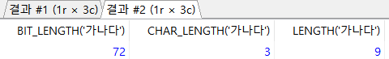

# 7.2.1. MariaDB 내장 함수(1)

> 자주사용되는 것 위주로 나열한다.


## 제어 흐름 함수

> 프로그램의 흐름을 제어한다.


* `IF (수식, 참 거짓)` : 수식이 참 또는 거짓인지 결과에 따라 출력된다.

  ```mariadb
  SELECT IF (100>200, '참이다.', '거짓이다.')
  ```
  
  

* `IFNULL(수식1, 수식2)` : 수식1이 NULL이 아니면 수식1을 반환, 수식1이 NULL이면 수식2를 반환한다.

  ```mariadb
  SELECT IFNULL(100, '널이군요'), IFNULL(NULL, '널이군요');
  ```

  

* `NULLIF(수식1, 수식2)` : 수식1과 수식2가 다르면 수식1이, 같으면 `NULL`이 반환된다.

  ```mariadb
  SELECT NULLIF(100, 200), NULLIF(100, 100)
  ```

  

* `CASE ~ WHEN ~ ELSE ~ END` : `CASE`는 내장함수가 아닌 연산자이다. 다중 분류에 사용될 수 있으니 내장함수와 함꼐 알아본다.

  ```mariadb
  SELECT CASE 10
  	   WHEN 1 THEN '일'
  	   WHEN 5 THEN '오'
  	   WHEN 10 THEN '십'
  	   ELSE '모름'
  END;
  ```

  


## 문자열 함수

> 문자열을 조작하고 활용도가 높다.

* `ASCII(아스키코드)`, `CHAR(숫자)` : 문자의 아스키 코드값을 돌려주거나, 숫자의 아스키 코드값에 해당하는 문자를 돌려준다.

  ```mariadb
  SELECT CHAR(66), ASCII('A');
  ```

  

* `BIT_LENGTH(문자열)`, `CHAR_LENTH(문자열)`, `LENGTH(문자열)` : BIT 크기, 또는 문자의 크기를 반환한다. `CHAR_LENGTH()`는 문자의 개수를 반환하고 LENGTH()는 할당된 Byte 수를 반환한다.

  ```mariadb
  SELECT BIT_LENGHT('abc'), CHAR_LENGTH('abc'), LENGTH('abc');
  SELECT BIT_LENGTH('가나다'), CHAR_LENGTH('가나다'), LENGTH('가나다');
  ```

  

  

  * MariaDB 10.3은 기본으로 UTF-8 코드를 사용해 영문은 3Byte, 한글은 3X3=9Byte를 할당한다.

* `CONCAT(문자열1, 문자열2, ...)`, `CONCAT_WS(구분자,문자열1, 문자열2, ...)` : 문자열을 연결한다. 특히, `CONCAT_WS()`는 구분자와 함꼐 문자열을 이어준다.

  ```mariadb
  SELECT CONCAT_WS('/', '1991', '09', '28');
  ```

  

* `ELT(위치, 문자열1, 문자열2, ...)`, `FIELD(찾을 문자열, 문자열1, 문자열2)`, `FIND_IN_SET(찾을 문자열, 문자열 리스트)`, `INSTR(기준 문자열, 부분 문자열)`, `LOCATE(부분 문자열, 기준 문자열)`

  * `ELT()` : 위치 번째에 해당하는 문자열을 반환한다.
  * `FIELD()` : 찾는 문자열의 위치를 찾아 반환한다.
  * `FIND_IN_SET()` : 찾을 문자열을 문자열 리스트에서 찾아서 위치를 반환한다. 여기서 문자열 리스트는 콤마(,)로 구분되야 하며 공백은 없어야 한다.
  * `INSTR()` : 기준 문자열에서 부분 문자열을 찾아 그 시작 위치를 반환한다.
  * `LOCATE()` : `INSTR()`과 동일하지만 파라미터 순서만 반대로 되어있다. `POSITION()`과 동일한 함수이다.

  ```mariadb
  SELECT ELT(2, '하나', '둘', '셋'), 
  		 FIELD('둘', '하나', '둘', '셋'), 
  		 FIND_IN_SET('둘', '하나,둘,셋'), 
  		 INSTR('하나둘셋','둘'), 
  		 LOCATE('둘', '하나둘셋');
  ```

  


* `FORMAT(숫자, 소수점 자릿수)` : 숫자를 소수점 아래 자릿수까지 표현한다.

  ```mariadb
  SELECT FORMAT(123456.123456, 4);
  ```

  

* `BIN(숫자)`, `HEX(숫자)`, `OCT(숫자)` : 2진수, 16진수, 8진수 값을 반환한다.

  ```mariadb
  SELECT BIN(31), HEX(31), OCT(31);
  ```

  

* `INSERT(기준 문자열, 위치, 길이, 삽입할 문자열)` : 기준 문자열의 위치부터 길이만큼을 지우고 삽입할 문자열을 끼워 넣는다.

  ```mariadb
  SELECT INSERT('abcdefghi', 3, 4, '@@@@'), INSERT('abcdefghi', 3, 2, '@@@@');
  ```

  

  * `INSERT('abcdefghi', 3, 4, '@@@@')` : 세번째 문자인 c부터 4개의 문자를 지우고 `@@@@`를 삽입했다.
  * `INSERT('abcdefghi', 3, 2, '@@@@')` : 세번째 문자인 c부터 2개의 문자를 지우고 `@@`를 삽입했다.

* `LEFT(문자열, 길이)`, `RIGHT(문자열, 길이)` : 왼쪽 또는 오른쪽에서 문자열의 길이만큼 반환한다.

  ```mariadb
  SELECT LEFT('abcdefghi', 3), RIGHT('abcdefghi', 4);
  ```

  

* `UPPER(문자열)`, `LOWER(문자열)` : 소문자를 대문자로, 대문자를 소문자로 변경한다.

  ```mariadb
  SELECT LOWER('abcdEFGH'), UPPER('abcdEFGH');
  -- abcdefgh, ABCDEFGH
  ```

  * 각각, UCASE(), LCASE()와 동일한 함수이다.

* `LPAD(문자열, 길이, 채울 문자열)`, `RPAD(문자열, 길이, 채울 문자열)` : 문자열을 길이만큼 늘린 후에, 빈 곳을 채울 문자열로 채운다.

  ```mariadb
  SELECT LPAD('이것이', 5, '##'), RPAD('이것이', 5, '##')
  ```

  

* `LTRIM(문자열)`, `RTRIM(문자열)` : 문자열의 왼쪽/오른쪽 공백을 제거한다. 중간의 공백을 제거하지는 않는다.

  ```mariadb
  SELECT LTRIM('   이것이'), RTRIM('이것이   ');
  ```

  

* `TRIM(문자열)`, `TRIM(방향 자를_문자열)`

  ```mariadb
  SELECT TRIM('   이것이    '), TRIM(BOTH 'ㅋ' FROM 'ㅋㅋㅋ이것이ㅋㅋ'), TRIM(LEADING 'ㅋ' FROM 'ㅋㅋㅋ이것이ㅋㅋ'), TRIM(TRAILING 'ㅋ' FROM 'ㅋㅋㅋ이것이ㅋㅋ');
  ```

  

* `REPEAT(문자열, 횟수)` : 문자열을 횟수만큼 반복한다.

  ```mariadb
  SELECT REPEAT('이것이', 3)
  -- '이것이이것이이것이'
  ```

* `REPLACE(문자열, 원래 문자열, 바꿀 문자열)` : 주어진 문자열에서 원래 문자열을 찾아서 바꿀 문자열로 바꾼다.

  ```mariadb
  SELECT REPLACE('이것이 MariaDB다', '이것이', 'This is');
  ```

  

* `REVERSE(문자열)` : 문자열 순서를 거꾸로 만든다.

  ```mariadb
  SELECT REVERSE('MariaDB')
  -- BDairaM
  ```

* `SPACE(길이)` : 길이 만큼의 공백을 반환한다.

  ```mariadb
  SELECT CONCAT('이것이',SPACE(10), 'MariaDB다')
  ```

  

* `SUBSTRING(문자열, 시작위치, 길이)` 또는 `SUBSTRING(문자열 FROM 시작위치 FOR 길이)` : 시작 위치부터 길이만큼 문자를 반환한다. 길이가 생략되면 문자열 끝까지 반환한다. 참고로 `SUBSTR()`, `MID()`와 모두 동일한 함수이다.

  ```mariadb
  SELECT SUBSTRING('대한민국만세', 3, 2);
  ```

  

* `SUBSTRING_INDEX(문자열, 구분자, 횟수)` : 문자열에서 구분자가 왼쪽부터 횟수 번째 나오면 그 이후의 오른쪽은 버린다. 횟수가 음수면 오른쪽부터 세고 왼쪽을 버린다.

  ```mariadb
  SELECT SUBSTRING_INDEX('cafe.naver.com', '.', 2), SUBSTRING_INDEX('cafe.naver.com', '.', -2);
  ```

  