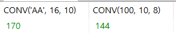
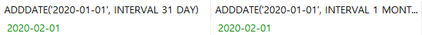
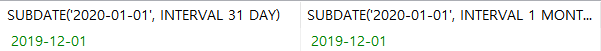
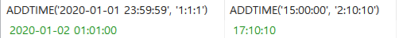
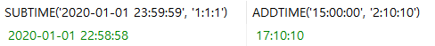
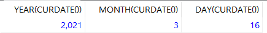
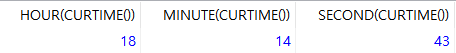
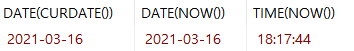

# 7.2.1. MariaDB 내장 함수(2)

> 자주사용되는 것 위주로 나열한다.


## 수학 함수

> DBMS에서 많은 수학 함수가 제공된다.


* `ABS(숫자)`
* `ACOS(숫자)`, `ASIN(숫자)`, `ATAN(숫자)`, `ATAN2(숫자)`, `COS(숫자)`, `SIN(숫자)`, `TAN(숫자)`

* `CEILING(숫자)`, `FLOOR(숫자)`, `ROUND(숫자)`

* `CONV(숫자, 원래 진수, 변환할 진수)` : 숫자를 원래 진수에서 변환할 진수로 계산한다.

  ```mariadb
  SELECT CONV('AA', 16, 10), CONV(100, 10, 8);
  ```

  

* `DEGREES(숫자)`, `RADIANS(숫자)`, `PI()` : 라디안 값을 각도값으로, 각도값을 라디안 값으로 변환한다. `PI()`는 파이값이 3.141592를 반환한다.
* `EXP(숫자)`, `LN(숫자)`, `LOG(숫자)`, `LOG(밑, 숫자)`, `LOG2(숫자)`, `LOG10(숫자)`  : `LOG(숫자)`는 밑이 e 이 로그이다.

* `MOD(숫자1, 숫자2)`, `숫자1 % 숫자2`, `숫자1 MOD 숫자2` : 숫자1을 숫자2로 나눈 나머지 값을 구한다.

* `POW(숫자1, 숫자2)`, `SQRT(숫자)`
* `RAND()` : 0이상 1미만의 실수를 구하다. 만약 m 이상 n미만의 임의의 정수를 구하고 싶다면 `FLOOR( m + RAND() * (n-m) )`

* `SIGN(숫자)` : 부호에 따라 1, 0, -1 중 하나를 반환한다.
* `TRUNCATE(숫자, 정수)` : 숫자를 소수점을 기준으로 정수 위치까지 구하고 나머지는 버린다.


## 날짜 및 시간 함수

> 날짜 및 시간을 조작하는 다양한 함수를 사용할 수 있다.


* `ADDDATE(날짜, 차이)`, `SUBDATE(날짜, 차이)` : 날짜를 기준으로 차이를 더하거나 뺀다.

  ```mariadb
  SELECT ADDDATE('2020-01-01', INTERVAL 31 DAY), ADDDATE('2020-01-01', INTERVAL 1 MONTH);
  SELECT SUBDATE('2020-01-01', INTERVAL 31 DAY), SUBDATE('2020-01-01', INTERVAL 1 MONTH);
  ```

  

  

  * `DATE_ADD()`와 `DATE_SUB()` 도 동일한 함수이다.

* `ADDTIME(날짜/시간, 시간)`, `SUBTIME(날짜/시간, 시간)` : 날짜/시간 기준으로 시간을 더하거나 뺀다.

  ```mariadb
  SELECT ADDTIME('2020-01-01 23:59:59', '1:1:1'), ADDTIME('15:00:00', '2:10:10');
  SELECT SUBTIME('2020-01-01 23:59:59', '1:1:1'), ADDTIME('15:00:00', '2:10:10');
  ```

  

  

* `CURDATE()`, `CURTIME()`, `NOW()`,`SYSDATE()` 
  * CURDATE() : 현재 연-월-일
  * CURTIME() : 현재 시:분:초
  * NOW(), SYSDATE() : 현재 연-월-일-시:분:초

* `YEAR(날짜)`, `MONTH(날짜)`, `DAY(날짜)`, `HOUR(시간)`, `MINUTE(시간)`, `SECOND(시간)`, `MICROSECOND(시간)` : 날짜 또는 시간에서 연, 월, 일, 시, 분, 초, 밀리초를 구한다.

  ```mariadb
  SELECT YEAR(CURDATE()), MONTH(CURDATE()), DAY(CURDATE());
  SELECT HOUR(CURTIME()), MINUTE(CURTIME()), SECOND(CURTIME());
  ```

  

  

* `DATE()`, `TIME()` : DATETIME 형식에서 연-월-일 및 시:분:초만 추출한다.

  ```mariadb
  SELECT DATE(CURDATE()), DATE(NOW()), TIME(NOW())
  ```

  


