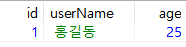
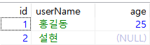
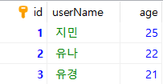
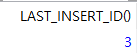
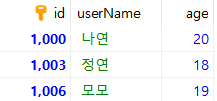
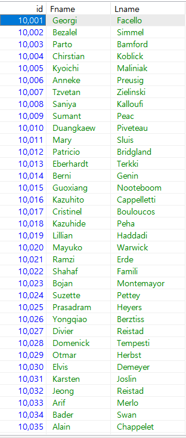

# 6.2.1 데이터의 삽입 : INSERT

> INSERT 문에 대해서 알아본다.


## INSERT문 기본 형식

* 기본 형식

  ```mariadb
  INSERT [INTO] 테이블[(열1, 열2, ...)] VALUES (값1, 값2, ...)
  ```

  

* 주의 사항

  * 테이블 이름 다음에 나오는 열은 생략 가능하다.

  * 생략할 경우 VALUES 다음에 오는 값들의 순서 및 개수가 테이블이 정의된 열 순서 및 개수와 동일해야 한다. 예제로 다음과 같은 TABLE을 하나 만들어 열을 생략하면 다음과 같다.

    ```mariadb
    USE SQLDB;
    CREATE TABLE testTBL1 (id INT, userName CHAR(3), age INT);
    INSERT INTO testtbl1 VALUES (1, '홍길동', 25);
    ```

    

    만약, id와 이름만 입력하고 나이를 입력하고 싶지 않다면, 다음과 같이 작성하면 된다.

    ```mariadb
    INSERT INTO testtbl1(id, username) VALUES (2, '설현')
    ```

    

    참고로, 열의 순서를 바꿔 입력하고 싶다면, `VALUES`의 순서도 열의 순서와 일치하게 넣어주어야 한다.


## 자동으로 증가하는 AUTO_INCREMENT

> 테이블의 속성으로 AUTO_INCREMENT로 지정됐을 때 INSERT에서는 해당 열이 없다고 가정하고 입력하면 된다.

* AUTO_INCREMENT : 자동으로 1부터 증가하는 값을 입력해 준다.

* 지정할 때는 PRIMARY KEY 또는 UNIQUE로 지정해 주어야 하며, 데이터 형은 숫자 형식만 사용할 수 있다.

  `AUTO_INCREMENT` 지정된 열은 `INSERT`문에서 `NULL`값을 지정하면 자동으로 값이 입력된다.

  ```mariadb
  USE SQLDB;
  CREATE TABLE TESTTBL2
  	(id INT AUTO_INCREMENT PRIMARY KEY, userName CHAR(3), age INT);
  INSERT INTO testtbl2 VALUES (NULL, '지민', 25); -- id값에 NULL 부여
  INSERT INTO testtbl2 VALUES (NULL, '유나', 22); -- id값에 NULL 부여
  INSERT INTO testtbl2 VALUES (NULL, '유경', 21); -- id값에 NULL 부여
  SELECT * FROM testtbl2;
  ```

  

* 만약 어느 숫자까지 증가되었는지 확인하고 싶다면 `SELECT LAST_INSERT_ID()`문을 사용하면 된다.

  ```mariadb
  SELECT LAST_INSERT_ID()
  ```

  

* AUTO_INCREMENT의 다음값을 변경하고 싶다면 (예를 들어, 100부터) 다음과 같이 입력하면 된다.

  ```MARIADB
  ALTER TABLE TESTTBL2 AUTO_INCREMENT=100;
  INSERT INTO TESTTBL2 VALUES(NULL, '찬미', 23);
  SELECT * FROM TESTTBL2;
  ```

* AUTO_INCREMENT의 증가량의 디폴트는 1이지만 `SET @@auto_increment_incremnt=새 증가량`을 입력해 변경가능하다.

  ```mariadb
  USE SQLDB;
  CREATE TABLE TESTTBL3 id INT AUTO_INCREMENT PRIMARY KEY, userName CHAR(3), age INT);
  ALTER TABLE TESTTBL3 AUTO_INCREMENT=1000;
  SET @@auto_increment_increment=3;
  INSERT INTO testtbl3 VALUES (NULL, '나연', 20);
  INSERT INTO testtbl3 VALUES (NULL, '정연', 18);
  INSERT INTO testtbl3 VALUES (NULL, '모모', 19);
  SELECT * FROM testtbl3;
  ```

  

  위의 `INSERT` 부분의 3줄은 다음과 같이 한 줄로 변경가능하다.

  ```mariadb
  INSERRT INTO testtbl3 VALUES (NULL, '나연', 20), (NULL, '정연', 18), (NULL, '모모', 19);
  ```

  

## 대량의 샘플 데이터 생성

> 지금까지 직접 키보드로 입력해 많은 시간이 걸렸지만 `INSERT INTO...SELECT` 구문을 사용해 다른 테이블의 데이터를 가져와 대량으로 입력하는 효과를 낼 수 있다.

* 형식

  ```mariadb
  형식 :
  INSERT INTO 테이블이름 (열이름1, 열이름2, ...)
  	SELECT 문;
  ```

  * 여기서 SELCT문의 결과 열의 개수는 INSERT를 할 열 개수와 일치해야 한다.

* 예제

  ```mariadb
  USE SQLDB;
  CREATE TABLE TESTTBL4 (id INT, Fname VARCHAR(50), Lname VARCHAR(50));
  INSERT INTO TESTTBL4
  	SELECT emp_no, first_name, last_name 
  		from employees.employees;
  ```

  

  테이블 정의까지 생략학 싶다면 `CREATE TABLE...SELECT`구문을 사용하면 된다.

  ```mariadb
  USE SQLDB;
  CREATE TABLE TESTTBL5 (SELECT emp_no, first_name, last_name FROM EMPLOYEES.EMPLOYEES); 
  ```

  

