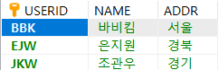

# 6.2.4 조건부 데이터 입력, 변경

> INSERT문을 사용할 때 기본 키가 중복된 데이터를 입력하면 입력되지 않는다. 따라서 MariaDB에서 오류가 발생해도 계속 진행하는 방법을 알아본다.


* 단계1 : 멤버 테이블(memberTBL)을 정의하고, userTBL에서 간단히 아이디, 이름, 주소만 가져와 간단히 데이터를 만든다. 

  ```mariadb
  USE SQLDB;
  CREATE TABLE MEMBERTBL (SELECT USERID, NAME, ADDR FROM usertbl LIMIT 3);
  ALTER TABLE MEMBERTBL
  	ADD CONSTRAINT PK_MEMBERTBL PRIMARY KEY (USERID); --PK로 지정
  SELECT * FROM MEMBERTBL
  ```

  

* 단계2 : PRIMARY KEY가 중복 된 데이터를 입력해본다.

  ```mariadb
  INSERT INTO membertbl VALUES('BBK', '비비코', '미국');
  INSERT INTO membertbl VALUES('SJH', '서장훈', '서울');
  INSERT INTO membertbl VALUES('HJY', '현주엽', '경기');
  SELECT * FROM membertbl;
  ```

  * `'BBK'`가 겹쳤기 때문에 1행에서 오류가 발생한다.


* 단계3 : INSERT IGNORE문으로 바꿔서 다시 실행해 본다. 경고 창은 무시하자.

  ```mariadb
  INSERT IGNORE INTO membertbl VALUES('BBK', '비비코', '미국');
  INSERT IGNORE INTO membertbl VALUES('SJH', '서장훈', '서울');
  INSERT IGNORE INTO membertbl VALUES('HJY', '현주엽', '경기');
  SELECT * FROM membertbl;
  ```

  

  * 첫번째 데이터는 오류 때문에 입력 되지 않았지만 나머지 2건은 추가로 입력되었다.
  * `INSERT IGNORE`는 PK가 중복되어도 오류를 발생시키지 않고 무시하고 넘어간다.

* 단계 4 : 입력 시, 기본 키가 중복되면 데이터가 수정되도록 해본다.

  ```mariadb
  INSERT INTO membertbl VALUES('BBK', '비비코', '미국')
  	ON DUPLICATE KEY UPDATE NAME='비비코', addr='미국';
  INSERT INTO membertbl VALUES('DJM', '동짜몽', '일본')
  	ON DUPLICATE KEY UPDATE NAME='동짜몽', addr='일본';
  SELECT * FROM membertbl;	
  ```

  

  * 첫 번째 행에서 `BBK`는 중복되었으므로 `UPDATE`문이 수행되었다.
  * 두 번째 입력한 `DJM`은 중복이 아니므로 일반적인 `INSERT`문이 수행되었다.

##### ※ ON DUPICATE KEY UPDATE는 PK가 중복되지 않으면 INSERT가 되고, 중복되면 그 뒤의 UPDATE 문을 수행한다.

