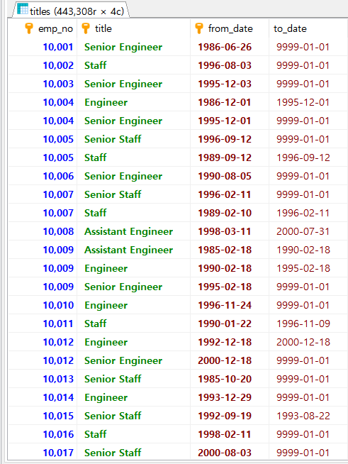
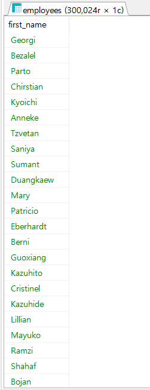
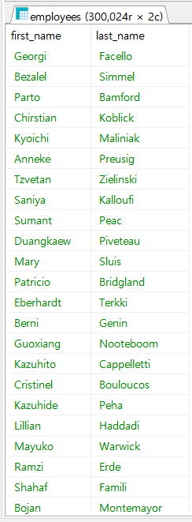
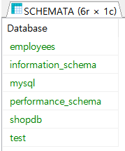
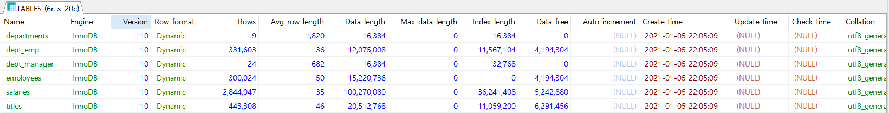
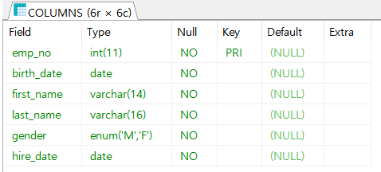
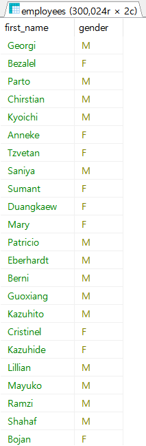

# 6.1 SELECT 문

> 가장 기본적인 `SELECT 열이름 FROM 테이블이름 WHERE 조건` 에 살을 붙여가며 `SELECT`문을 정복하자.


## Use 구문

> 현재 사용하는 데이터베이스를 지정 또는 변경하는 구문 형식이다. `USE 데이터베이스_이름;` 형식으로 입력한다.

```mariadb
USE employees; -- 지금부터 employees를 사용하겠으니, 모든 쿼리는 employees에서 수행하라. 
```


## SELECT & FROM

```mariadb
SELECT * FROM titles ; -- titles 테이블에서 모든 열의 내용을 가져와라.
/* 영향 받은 행: 0  찾은 행: 443,308  경고: 0  지속 시간 1 쿼리: 0.000 초 (+ 0.266 초 네트워크) */
```



* 영향 받은 행(Affected rows) : 변경된 행의 개수를 나타낸다. `SELECT`문은 행을 변경하지 않는다.
* 찾은 행 : `SELECT`문은 조회된 행의 개수가 나온다.
* 경고 : 경고가 발생된 경우 경고의 개수가 나온다.
* 지속시간 1 쿼리 :  실행된 쿼리의 개수와 쿼리가 실행된 시간을 나타낸다.
* ( +  0.266 초 네트워크) : 네트워크 전송시간을 나타낸다.


* `*` : 모든 것 , 모든 열을 의미, 특정한 열을 얻으려면 이 위치에 얻고 싶은 열을 입력하면 된다.
* `FROM` :  다음으로 테이블/뷰 등의 항목이 나온다.


```mariadb
SELECT * FROM employees.titles;
```

테이블의 이름은 `emplyees.tiltes`로 원칙적으로 위와 같이 사용하여야 하지만 

이미 선택된 데이터베이스 이름이 자동으로 붙어 아래 두 쿼리는 동일하다.

```makefile
SELECT * FROM employees.titles;
SELECT * FROM titles ;
```


다음과 같이 입력하면 사원테이블(employees)의 이름만 가져올 수 있다.

```mariadb
SELELCT first_name FROM employees;
/* 영향 받은 행: 0  찾은 행: 300,024  경고: 0  지속 시간 1 쿼리: 0.000 초 (+ 0.063 초 네트워크) */
```




여러 개의 열을 가져오고 싶으면 `,`로 구분하면 된다.  순서는 사용자의 마음이다.

```mariadb
SELECT first_name, last_name FROM employees;
```




### 예제

> 데이터베이스 이름, 테이블 이름, 필드 이름이 정확히 기억나지 않을 때 조회하는 방법이다.

1. 현재 서버에 어떤 데이스베이스가 있는지 조회한다.

```mariadb
SHOW DATABASES;
```



2. 찾는 데이터 베이스를 지정한다.

```mariadb
USE employees
```

3. 현재 데이터베이스에 있는 테이블을 조회한다.

```mariadb
SHOW TABLE STATUS;
```



4. 위에서 `employees` 테이블 이름을 찾았으니 테이블 열을 조회한다.

```mariadb
DESCRIBE employees; -- DESC employees; 도 된다.
```



5. `first_name` 열과 `gender` 열을 조회한다.

```mariadb
SELECT first_name, gender FROM employees;
```

