# 6.1 SELECT 문 (2)

> 가장 기본적인 `SELECT 열이름 FROM 테이블이름 WHERE 조건` 에 살을 붙여가며 `SELECT`문을 정복한다.


## 기본적인 WHERE문

`WHERE`절은 조회하는 결과에 특정한 조건을 주어 원하는 데이터만 볼 때 사용한다. 형식은 다음과 같다.

```mariadb
SELECT 필드이름 FROM 테이블이름 WHERE 조건식;
```


* 예제

  ```PYTHON
  USE SQLDB;
  SELECT * FROM USERTBL WHERE NAME='김경호'; 
  ```

  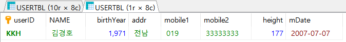


## 관계 연산자의 사용

> `AND`, `OR`  사용법이다.

* 예제1(`AND`) : 1970년 이후에 출생하고, 신장이 182 이상인 사람의 아이디와 이름을 조회해 보자.

  ```mariadb
  SELECT userid, name FROM usertbl WHERE birthyear>=1970 AND height >= 182;
  ```

* 예제 2(`OR`) : 1970년 이후에 출생했거나, 신장이 182 이상인 사람의 아이디와 이름을 조회해 보자.

  ```mariadb
  SELECT userid, name FROM usertbl WHERE birthyear>=1970 or height >= 182;
  ```


## BETWEEN...AND, IN() 그리고 LIKE


1. `BETWEEN`...`AND` : 연속적인 값을 가지고 있는 경우 `BETWEEN`... `AND` 구문을 사용할 수 있다.

* 예제 : 키가 180 이상 183이하의 값을 출력한다.

  ```mariadb
  SELECT NAME, height FROM usertbl WHERE height BETWEEN 180 AND 183;
  ```
  * `SELECT NAME, height FROM usertbl WHERE height >= 180 AND height <= 183;`와 같은 표현이다.

2. 이산적인 값에 대해서는 `IN()` 구문을 사용할 수 있다.

* 예제 : 지역이 '경남', '전남' 또는 '경북'인 경우를 출력한다.

  ```mariadb
  SELECT NAME, addr FROM usertbl WHERE addr IN ('경남', '전남', '경북');
  ```

  * `SELECT NAME, addr FROM usertbl WHERE addr='경남' OR addr='전남' OR addr='경북';`와 같은 표현이다.

3. 문자열에 대해서는 다음과 같이  `LIKE` 구문을 사용할 수 있다.

* 예제1 : 이름이 `김`으로 시작하는 사람을 조회한다. 여기서 `%`를 사용한다.

  ```mariadb
  SELECT NAME, height FROM usertbl WHERE NAME LIKE '김%';
  ```

  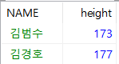

* 예제2 : 앞글자 하나를 모를 때 `_` 사용해 표현할 수 있다.

  ```mariadb
  SELECT NAME, height FROM usertbl WHERE NAME LIKE '_종신';
  ```

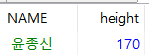

* 예제3 : `_` 와 `%`를 조합해 사용할 수 있다.

  ```mariadb
  SELECT NAME, height FROM usertbl WHERE NAME LIKE '_용%';
  ```

  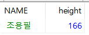

##### ※단, `%`와 `_`를 사용하면 MariaDB 성능에 나쁜 영향을 끼칠 수 있다. 예를 들어 `%용`과 같이 검색하면 name열에 index가 있더라도 index를 사용하지 않고 전체 데이터를 검색하게 된다.


## ANY/ALL/SOME 그리고 서브쿼리(SubQuery, 하위쿼리)

> 서브쿼리란 쿼리문 안에 또 쿼리문이 들어 있는 것을 얘기한다.

예를 들어, 김경호의 키보다 크거나 같은 사람들의 이름과 키를 출력하려면, 다음과 같이 김경호의 키 177를 직접 입력해야 한다.

```mariadb
SELECT NAME, HEIGHT FROM USERTBL WHERE HEIGHT > 177;
```

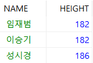

하지만, 다음과 같이 177 대신 쿼리를 통해 사용가능하다.

```mariadb
SELECT NAME, HEIGHT FROM usertbl WHERE HEIGHT >= (SELECT HEIGHT FROM usertbl WHERE NAME = '김경호');
```


* ANY 구문(OR의 개념이다. 또한 SOME과 같은 기능이다.) : 위와 유사하게 지역이 `'경남'`인 사람보다 키가 크거나 같은 사람들의 이름과 키를 출력해보자.

  ```mariadb
SELECT NAME, HEIGHT FROM usertbl WHERE HEIGHT >= (SELECT HEIGHT FROM usertbl WHERE addr='경남')
  ```
  
  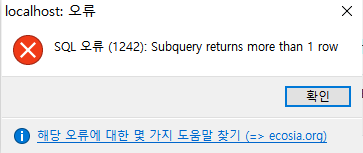

  그러나 지역이 `'경남'`인 사람들의 키는 하나의 값이 아니기 때문에 위와 같이 ERROR가 발생하는것을 알 수 있다. 이 때 ANY 구문이 필요하다.

  ```MARIADB
SELECT NAME, HEIGHT FROM usertbl WHERE HEIGHT >= ANY (SELECT HEIGHT FROM usertbl WHERE addr='경남')
  ```

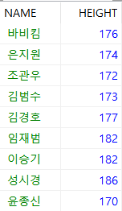

​		출력 결과를 보면 173보다 크거나 같은 사람 또는 키가 170보다 크거나 같은 사람이 모두 출력됐다. 즉 170이상의 사람들이 출력됐다.

* ALL 구문 (AND의 개념이다.) : 위의 코드에서 ANY 부분을 ALL로 바꿔본다.


  ```MARIADB
  SELECT NAME, HEIGHT FROM usertbl WHERE HEIGHT >= all(SELECT HEIGHT FROM usertbl WHERE addr='경남')
  ```

  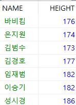

  이 때  AND의 개념이기 때문에 173 이상의 사람들만 출력됐다.


## 원하는 순서대로 정렬하여 출력:ORDER BY

>결과물에 대해 영향을 미치지는 않지만, 결과가 출력되는 순서를 조절하는 구문이다. 디폴트는 오름차순이다.

```mariadb
SELECT NAME, MDATE FROM usertbl ORDER BY MDATE;
```

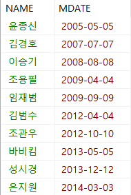

내림차순을 원할때는 쿼리문 마지막에 `DESC`를 붙여주면 된다.

```MARIADB
SELECT NAME, MDATE FROM usertbl ORDER BY MDATE DESC;
```

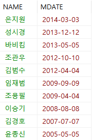


여러가지 조건으로 sorting도 가능하다. 쉼표를 사용해 여러개를 나열하면 된다. `ASC` 경우는 생략해도 무방하다.

```mariadb
SELECT NAME, HEIGHT FROM usertbl ORDER BY HEIGHT DESC, NAME ASC;
```


##### ※`ORDER BY`를 사용할 때 주의할 점은 쿼리문 가장 마지막 부분에 등장해야 한다.  또한 MariaDB 성능을 상당히 떨어뜨릴 가능성이 있기 때문에 되도록 안쓰는게 좋다.


## 중복을 하나만 남기는 DISTINCT

> 다른 언어에서 unique로 사용되는 방법이다. 

````mariadb
SELECT DISTINCT ADDR FROM usertbl;
````

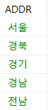


## 출력하는 개수를 제한하는 LIMIT

> 몇개의 개수만 출력할 때 사용하는 방법이다. 끝에 `LIMIT 개수`를 입력해주면 된다. `ORDER BY`와 함께 사용해주면 유용하다.

```mariadb
USE employees;
SELECT emp_no, hire_date from employees ORDER BY hire_date LIMIT 5;
```

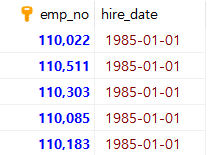

`LIMIT 시작, 개수` 형식으로 시작 지점을 바꿀 수도 있다.

```MARIADB
USE employees;
SELECT emp_no, hire_date from employees ORDER BY hire_date LIMIT 5, 5; --  LIMIT 5 OFFSET 5 과 동일하다
```

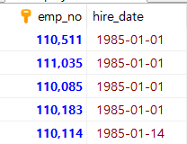


## 테이블을 복사하는 CREATE TABLE ... SELECT

> 테이블을 복사해서 사용할 경우에 주로 사용한다. 형식은 다음과 같다.

```mariadb
CREATE TABLE 새로운 테이블명 (SELECT 복사할열 FROM 기존 테이블명)
```


* 예제

  ```MARIADB
  USE SQLDB;
  CREATE TABLE buytbl2 (SELECT * FROM buytbl);
  SELECT * FROM buytbl2;
  ```

  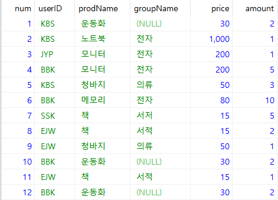

  일부 열만 복사할 수도 있다.


##### ※ 참고로 기존의 PK나 FK등의 제약 조건은 복사되지 않는다.