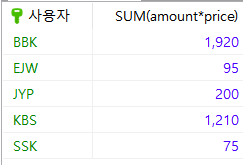
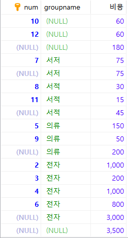

# 6.1 SELECT 문 (3)

> 가장 기본적인 `SELECT 열이름 FROM 테이블이름 WHERE 조건` 에 살을 붙여가며 `SELECT`문을 정복한다.


## GROUP BY절

> 말 그대로 그룹으로 묶어주는 역할을 한다.

* 예제1 : 기본사용법

  ```mariadb
  SELECT USERID, SUM(AMOUNT) FROM buytbl GROUP BY USERID;
  ```

  * 여기서 `SUM`은 집계함수이다.

  

* 예제 2 : 별칭 사용(`AS` 사용)

  ```mariadb
  SELECT USERID AS '사용자 아이디', SUM(AMOUNT) AS '총 구매 개수' FROM buytbl GROUP BY USERID;
  ```

  

## 집계 함수

> 보통 `GROUP BY`와 함께 자주 사용된다.

| 함수명          | 설명                                 |
| --------------- | ------------------------------------ |
| AVG()           | 평균을 구한다.                       |
| MIN()           | 최솟값을 구한다.                     |
| MAX()           | 최댓값을 구한다.                     |
| COUNT()         | 행의 개수를 센다.                    |
| COUNT(DISTINCT) | 행의 개수를 센다.(중복은 1개만 인정) |
| STDEV()         | 표준편차를 구한다.                   |
| VAR_SAMP()      | 분산을 구한다.                       |


* AVG()

  ```mariadb
  SELECT AVG(AMOUNT) AS '평균 구매 개수' FROM buytbl;
  ```

  

* MIN(), MAX()

  : 가장 큰 키와 가장 작은 키의 회원 이름과 키를 출력 하자. 서브쿼리와 조합하는 것이 수월하다.

  ```mariadb
  SELECT NAME, height FROM usertbl WHERE height=(SELECT MIN(height) FROM usertbl) OR height=(SELECT max(height) FROM usertbl) 
  ```

  

* COUNT()

  : 휴대폰 사용자 수를 출력 하자.

  ```mariadb
  SELECT COUNT(MOBILE1) AS '휴대폰 있는 사용자 수' FROM usertbl 
  ```

  

## HAVING 절

> 집계함수의 경우 `WHERE`절에 나타날 수 없다. 이럴 때 `WHERE` 대신 `HAVING`을 사용한다. 순서로는 `GROPU BY` 다음에 등장해야 한다.

* 예제 : 다음의 총 구매액 1000원 이상인 사람에게 사은품을 주고 싶다. 

  ```mariadb
  SELECT userid AS '사용자', SUM(amount*price) FROM buytbl GROUP BY userid;
  ```

  

  구매 금액이 1000원이 넘는 사람을 출력하려면 다음과 같다.

  ```mariadb
  SELECT userid AS '사용자', SUM(amount*price) FROM buytbl GROUP BY userid
  	HAVING SUM(amount*price) > 1000;
  ```

  

  금액이 적은 순서로 출력 하려면 `ORDER BY`를 추가하면 된다.

  ```mariadb
  SELECT userid AS '사용자', SUM(amount*price) FROM buytbl GROUP BY userid
  	HAVING SUM(amount*price) > 1000
  	ORDER BY SUM(amount*price);
  ```


## ROLLUP

> 총합 또는 중간 합계가 필요하면 `GROUP BY`절과 `WITH ROLLUP`문을 사용하면 된다.

* 예제 : 분류(groupname)별로 합계 및 총합을 구하고 싶을 때 사용한다. 

  ```MARIADB
  SELECT num, groupname, SUM(price*amount) AS '비용' FROM buytbl
  	GROUP BY groupname, num
  	WITH rollup;
  ```

  