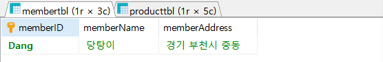
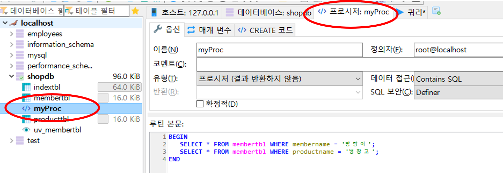

# 3.3.3 스토어드 프로시저(Stored Procedure)

> MariaDB 에서 제공하는 프로그래밍 기능이다. 실무에서는 `SQL문`(주로 `SELECT`)을 매번 하나하나 수행하기 보다는 스토어드 프로시저로 만들어 놓고 프로시저를 호출하는 방식을 많이 사용한다.


## 예제

1. 매번 회원 테이블 `당탕이`의 정보와 제품 테이블의 `냉장고`의 정보를 동시에 조회한다고 가정하자.

2. SQL 문으로 다음과 같이 동시에 수행하게 될것이다. ( 두 줄은 짧지만 더 긴 경우 상당히 불편할 것이다.)

```mariadb
SELECT * FROM membertbl WHERE membername = '당탕이';
SELECT * FROM producttbl WHERE productname = '냉장고';
```



3. `myProc()` 라는 스토어드 프로시저를 만든다.

```mariadb
DELIMITER //
CREATE PROCEDURE myProc()
BEGIN 
	SELECT * FROM membertbl WHERE membername = '당탕이';
	SELECT * FROM producttbl WHERE productname = '냉장고';
END //
DELIMITER ;
```

* DELIMITER : 구분 문자 를 의미하고 `;`을 `//` 로 대신한다는 의미이다.
* 쿼리문을 수행하면 다음과 같이 `shopdb`에 프로시저가 생기게 된다.

4. `myProc()` 실행

```mariadb
CALL myProc() ;
```


## 참고

* CREATE 문 

`CREATE 개체종류 개체이름 ~~`  형식을 사용한다.  예를 들어, 다음과 같이 사용한다.

```mariadb
CREATE TABLE 테이블_이름 ~~
CREATE VIEW 뷰_이름 ~~
CREATE PROCEDURE 스토어프로시저_이름() ~~
```

* DROP 문

CREATE 문과 유사하게 `DROP 개체종류 개체이름` 형식으로 간단히 사용한다.