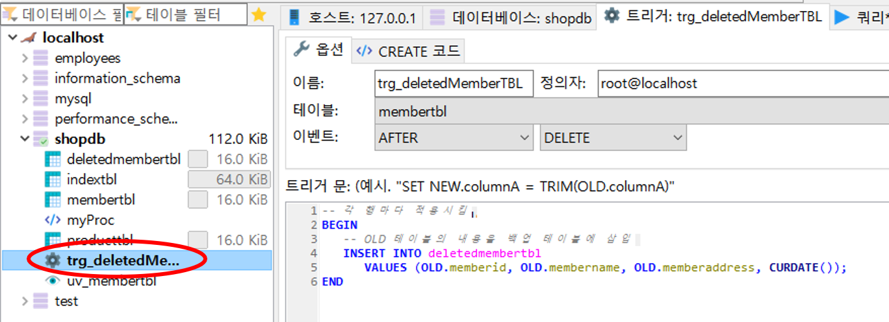

# 3.3.3 트리거(Trigger)

>테이블에 부착되, `INSERT`, `UPDATE`, `DELETE` 작업이 발생될 때 실행되는 코드이다.

예를 들어, 가입했던 회원중에 `당탕이`라는 회원이 **탈퇴**하는 경우를 생각해 보자.

탈퇴를 하면 `당탕이` 정보만 삭제하면 된다. (즉, `당탕이` 행 데이터만 지우게 된다.)


그러나 이미 데이터베이스에 존재하지 않기 때문에,  나중에 회원에서 탈퇴한 사람이 **누구인지** 정보를 알 수 있는 방법이 없다.


따라서 `당탕이`의 행 데이터를 삭제하기 전 데이털 다른 곳에 먼저 복사 해두면 되는데, 이것을 수작업으로 하면 지우기 전에 다른 곳에 복사해야 한다는 것을 깜박 잊을 수 있다!!!!


→ 회원 테이블에 삭제 작업이 일어날 경우 삭제 되기 전 미리 다른 곳에 삭제될 데이터를 **자동**으로 저장해주는 **기능**이 **트리거**의 대표적인 용도이다.


## 예제

* 일반 삭제시

1. 회원 테이블에 새로운 회원 `'Figure/연아/경기도 군포시 당정동'`을 입력한다.

```mariadb
INSERT INTO membertbl VALUES ('Figure', '연아', '경기도 군포시 당정동');
```

2. `SELECT`문 으로 데이터 입력을 확인해 본다.

```mariadb
SELECT * FROM membertbl
```


3. `연아` 의 `주소`를 변경해 본다.

```mariadb
UPDATE membertbl SET memberaddress ='서울 강남구 역삼동' WHERE membername = '연아';
```

4. 다시 확인

```mariadb
SELECT * FROM membertbl
```


5. 삭제

```mariadb
DELETE FROM membertbl where mebername = '연아';
```


* trigger 사용

1. 새로운 테이블인 `deletedMembertTBL` 을 만든다. 

```mariadb
CREATE TABLE deletedmembertbl (
	memberId CHAR(8),
	memberName CHAR(5),
	memberAddress CHAR(20),
	deletedDate DATE -- 삭제한 날짜
	);
```


2. `memberttbl`에서 `DELETE` 작업이 일어나면 백업 테이블`deletedmembertbl` 에 지워진 데이터가 기록되는 트리거를 생성한다.

```mariadb
DELIMITER //
CREATE TRIGGER trg_deletedMemberTBL -- 트리거 이름
	AFTER DELETE -- 삭제 후에 작동하게 지정
	ON membertbl -- 트리거를 부착할 테이블
	FOR EACH ROW -- 각 행마다 적용시킴
BEGIN 
	-- OLD 테이블의 내용을 백업 테이블에 삽입
	INSERT INTO deletedmembertbl
		VALUES (OLD.memberid, OLD.membername, OLD.memberaddress, CURDATE());
END //
DELIMITER ;

```




3. `당탕이`를 `membertbl` 에서 삭제 해본다.

```mariadb
DELETE FROM membertbl WHERE MEMBERNAME = '당탕이';
```


4. 백업 테이블을 확인해 본다.

```mariadb
SELECT * FROM deletedmembertbl ;
```


: 삭제한 날짜까지 자동으로 입력되어 있다.

