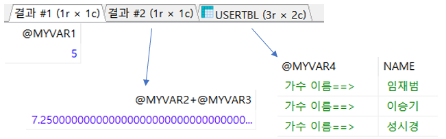
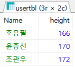
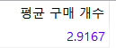
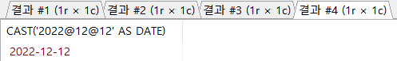
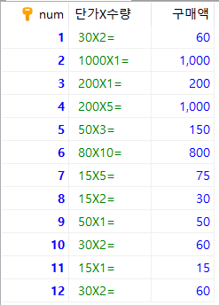

# 7.1.2 변수의 사용

> SQL도 다른 일반적인 프로그래밍 언어처럼 변수를 선언하고 사용 가능하다.

* 변수의 선언과 같의 대입은 다음의 형식을 따른다.

  ```mariadb
  SET @변수이름 = 변수의 값;  -- 변수의 선언 및 값 대입
  SELECT @변수이름;   	  -- 변수의 값 출력 
  ```

  * @변수명은 **전역** **변수**처럼 사용된다.
  * DECLARE 변수명은 스포어드 프로시저나 함수 안에서 **지역** **변수**처럼 사용된다.


* 예제 1

  ```mariadb
  USE SQLDB;
  SET @MYVAR1 = 5;
  SET @MYVAR2 = 3;
  SET @MYVAR3 = 4.25;
  SET @MYVAR4 = '가수 이름==> ';
  SELECT @MYVAR1;
  SELECT @MYVAR2+@MYVAR3;
  SELECT @MYVAR4, NAME FROM USERTBL WHERE HEIGHT > 180;
  ```

  

* 예제 2 : `LIMIT`에는 원칙적으로 변수를 사용할 수 없으나 `PREPARE`와 `EXECUTE`문을 활용해 변수의 활용도 가능하다.

  ```mariadb
  SET @MYVAR1 = 3;
  PREPARE MYQUERY
  	FROM 'SELECT Name, height from usertbl order by height limit ?';
  EXECUTE myquery USING @myvar1
  ```

  

  * LIMIT는 `LIMIT 3`과 같이 직접 숫자를 넣어야 하며, `LIMIT @변수` 형식으로 사용하면 오류가 발생한다. 따라서 다른 방식으로 사용하기 위해 `PREPARE 쿼리이름 FROM '쿼리문'` 구문은 `쿼리문`을 준비만 해놓고 실행하지 않는다. 그리고 `EXECUTE` 쿼리 이름을 만나는 순간에 실행된다. `USING @변수`를 이용해 쿼리문에서 `?`으로 처리해 놓은 부분에 대입된다. 따라서 `LIMIT @변수` 와 동일한 효과를 갖는다.

    

# 7.1.3 데이터 형식의 형 변환    

> 형 변환에는 `CAST()`와 `CONVERT()` 함수를 이용해서 데이터 형식을 변환하는 명시적인 변환이 있고 이 둘을 사용하지 않고 형 변환하는것을 암시적인 형 변환이라고 한다.


## 데이터 형식 변형 함수

> 가장 일반적으로 사용되는 데이터 형식 변환과 관련해서는 `CAST()`, `CONVERT()` 함수를 사용하는데 이 둘은 형식만 다를 뿐 거의 비슷한 기능을 한다.

* 기본 형식

  ```mariadb
  CAST( expression AS 데이터 형식 [ (길이) ] )
  CONVERT( expression, 데이터형식 [ (길이) ] )
  ```

  * CAST와 () 를 띄어쓰면 오류가 날때가 있다. 무조건 붙이도록 하자.

* 예제1

  1. `sqlDB` 구매 테이블(`buyTBL`)에서 평균 구매 개수를 구한다.

     ```mariadb
     USE sqlDB;
     SELECT AVG(amount) AS '평균 구매 개수' FROM buyTBL'
     ```

     

  2. 개수이므로 정수로 보기 위해 다음과 같이 `CAST()`나 `CONVERT()` 함수를 사용할 수 있다.

     ```mariadb
     USE sqldb;
     SELECT CAST( AVG(amount) AS SIGNED INTEGER) AS '평균 구매 개수' FROM buyTBL ;
     SELECT CONVERT ( AVG(amount) , SIGNED INTEGER) AS '평균 구매 개수' FROM buyTBL ;
     ```

     

     * 반올림한 정수의 결과를 확인할 수 있다.


* 예제2 : 다양한 구분자를 날짜 형식으로 변경

  ```MARIADB
  SELECT CAST('2022$12$12' AS DATE);
  SELECT CAST('2022/12/12' AS DATE);
  SELECT CAST('2022%12%12' AS DATE);
  SELECT CAST('2022@12@12' AS DATE);
  ```

  


* 예제3 : 결과를 보기 좋도록 처리한다. 단가(price)와 수량(amount)를 실제 입금액을 표시하는 쿼리는 다음과 같이 사용할 수 있다.

  ```mariadb
  SELECT num, CONCAT(CAST(price AS CHAR(10)), 'X', CAST(amout AS CHAR(4)), '=') AS '단가X수량', price*amount AS '구매액'
  	FROM buyTBL;
  ```

  


## 암시적인 형 변환

>  `CAST()`와 `CONVERT()` 함수를 사용하지 않고 형 변환하는것을 암시적인 형 변환이라고 한다.


* 예시

  ```mariadb
  SELECT '100' + '200'; -- 문자와 문자를 더함(정수로 변환되서 연산됨)
  SELECT CONCAT('100', '200'); -- 문자와 문자를 연결(문자로 처리)
  SELECT CONCAT(100, '200'); -- 정수와 문자를 연결(정수가 문자로 변환되서 처리)
  SELECT 1 > '2mega'; -- 정수 2로 변환되어서 비교
  SELECT 3 > '2MEGA'; -- 정수 2로 변환되어서 비교
  SELECT 0 = 'mega2'; -- 문자는 0으로 변환됨
  ```

  ```mariadb
  -- 300
  -- 100200
  -- 100200
  -- 0
  -- 1
  -- 1
  ```

  * 문자열+문자열은 더하기 연산자로 인해 숫자로 변경되어 계산됐다.
  * `CONCAT`은 문자열을 연결해주는 함수이기 때문에 문자열로 처리된다.
  * `1 > '2mega'`는 `1>2` 비교가 되서 거짓(0)이 나왔다.
  * 마지막 `0 = 'mega2'`은 문자열은 숫자로 변경되어도 0이므로 참(1)의 결과가 나왔다.

  

