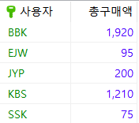
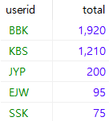
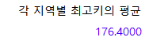

# 6.3 WITH절과 CTE

> WITH절은 CTE(Common Table Expression)를 표현하기 위한 구문이다. CTE는 기존의 뷰, 파생 테이블, 임시 테이블 등으로 사용되던 것을 대신할 수 있고, 더 간결하게 보여지는 장점이 있다.

* 비재귀적 CTE와 재귀적 CTE가 있으나 주로 비재귀적 CTE에 대해 학습한다.


## 비재귀적 CTE

> 단수한 형태이며, 복잡한 쿼리 문장을 단순화 하는데 사용된다.

* 형식

  ```mariadb
  WITH CTE_테이블명(열이름)
  AS
  (
  	<쿼리문>
  )
  SELECT 열이름 FROM CTE_테이블명
  ```

  * 비재귀적 CTE에는 `SELECT필드`들 `FROM CTE_테이블이름` 구문 외에 UPDATE 등도 가능하지만, 주로 `SELECT`문을 사용한다.

* 예제 1

  * 먼저  buyTBL에서 총 구매액을 구하는 것을 살펴본다.

    ```mariadb
    USE SQLDB;
    SELECT USERID AS '사용자', SUM(price*amount) AS '총구매액'
    	FROM buyTBL GROUP BY userid;
    ```

    

  * 만약 위 결과를 총 구매액이 많은 사용자 순서로 정렬하고 싶다면 `ORDER BY`문을 첨가해도 된다. 하지만 그럴 경우 SQL문이 복잡해 보인다.  따라서 위의 표를 abc라는 이름의 테이블이라고 생각하면 결과는 간단해 진다. 이것이 `CTE`의 장점이다.

    ```mariadb
    WITH abc(userid, total)
    AS
    (
    	SELECT userid, SUM(amount*price) 
        FROM buyTBL GROUP BY userid
    )
    SELECT * FROM abc ORDER BY total DESC;
    ```

    

    * `FROM abc` 구문에서 실존하는 테이블이 아니라, 바로 위 `WITH` 구문으로 만든 `SELECT`의 결과이다.


* 예제 2

  * 1단계 : 각 지역별로 가장 큰 키를 뽑는 쿼리를 작성한다.

    ```mariadb
    SELECT ADDR, MAX(HEIGHT) FROM userTBL GROUP BY ADDR
    ```

  * 2단계 : 위 쿼리를 WITH 구문으로 묶는다.

    ```mariadb
    WITH cte_userTBL(ADDR, maxHeight)
    AS
    	(SELECT ADDR, MAX(HEIGHT) FROM userTBL GROUP BY ADDR)
    ```

  * 3단계 : 키의 평균을 구하는 쿼리를 작성한다.

    ```mariadb
    WITH cte_userTBL(ADDR, maxHeight)
    AS
    	(SELECT ADDR, MAX(HEIGHT) FROM userTBL GROUP BY ADDR)
    SELECT AVG(maxHeight) AS '각 지역별 최고키의 평균' FROM cte_userTBL
    ```

    

* CTE는 뷰와 용도는 비슷하지만 개선된 점이 많다. 또한 뷰는 계속 존재해 다른 구문에서도 사용 가능 하지만 CTE와 파생 테이블은 구문이 끝나면 같이 소멸한다. 즉, cte_userTBL은 다시 사용할 수 없다. 