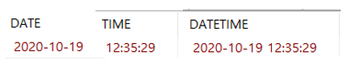

# 7.1.1 MariaDB에서 지원하는 데이터 형식의 종류

> 모두를 언급하면 좋으나 30개 가까이 되는것을 모두 외우는 것은 무리이다. 따라서 자주 사용되는 것 위주로 살펴본다.


## 숫자 데이터 형식

> 숫자형 데이터 형식은 정수, 실수 등의 숫자를 표현한다.

| 데이터 형식     | 바이트 수 | 설명 |
| --------------- | ---------  ---- | ---------  ---- |
| SMALLINT        | 2         | 정수 |
| INT INTEGER     | 4         | 정수 |
| BIGINT          | 8         | 정수 |
| FLOAT           | 4         | 소수점 아래 7자리 표현 |
| DOUBLE REAL     | 8         | 소수점 아래 15자리 표현 |
| DECIMAL(m, [d]) | 5~17      | 전체 자릿수(m)와 소숫점 이하 자릿수(d)를 가진 숫자형 |

* `DECIMAL`데이터 형식은 정확한 수치를 저장하게 되고 `FLOAT`, `REAL`은 근사치의 숫자를 저장한다.
* 반면에 `FLOAT`, `REAL`은 근사치의 숫자를 저장하지만 대신 상당히 큰 숫자를 저장할 수 있는 장점이 있다.
* 소수점이 들어간 실수를 저장하려면 되도록 `DECIMAL`을 사용하는게 바람직하다.
* MariaDB는 부호없는 정수를 지원하는데  `UNSIGNED`를 붙여주면 된다.


## 문자 데이터 형식

| 데이터 형식         | 바이트 수    | 설명                                                         |
| ------------------- | ------------ | ------------------------------------------------------------ |
| CHAR(n)             | 1~255        | 고정길이 문자형. n을1~255까지 지정. 그냥 `CHAR`만 적으면 `CHAR(1)` 과 같다. character의 약자 |
| VARCHAR(n)          | 1~65535      | 가변길이 문자형. n을 사용하면 1부터 65535까지 지정. Variable character의 약자 |
| BINARY(n)          | 1~255      | 고정길이의 이진 데이터 값 |
| LONGTEXT (TEXT 형식) | 1~4294967295 | 최대 4GB 크기의 TEXT 데이터 값                               |
| BLOB 형식 (TEXT 형식) | 1~4294967295 | 최대 4GB 크기의 BLOB 데이터 값                               |
| ENUM(값들...) | 1 또는 2 | 최대 65535개의 열거형 데이터 데이터 값                               |


* `CHAR` 형식은 고정길이 문자형으로 자릿수 고정된다. 예를 들어, `CHAR(100)`에 `'ABC'`글자만 입력해도 97칸을  더 확보해 97칸이 낭비 된다.
* `VARCHAR` 은 `CHAR`형식에 비해 공간을 효율적으로 운영할 수 있다.
* `CHAR` 형식이 INSERT/UPDATE시에 일반적으로 더 좋은 성능을 발휘한다.처럼 
* `BLOB` 형식은 사진 파일, 동영상 파일, 문서 파일 등의 대용량의 이진 데이터를 저장하는 데 사용한다.
* `ENUM`은 열거형 데이터를 사용할 때 사용한다. 예를 들어, 요일(월, 화, 수, 목, 금, 토, 일)을 `ENUM` 형식으로 설정할 수 있다.


## 날짜와 시간 데이터 형식

날짜와 시간형 데이터에 대해서는 간단한 예를 통해 확인한다.

| 데이터 형식 | 바이트 수 | 설명                                                         |
| ----------- | --------- | ------------------------------------------------------------ |
| DATE        | 3         | 날짜는 1001-01-01~9999-12-31까지 저장되며 날짜 형식만 사용, `YYYY-MM-DD` 형식으로 사용됨 |
| TIME        | 3         | `HH:MM:SS` 형식으로 사용                                     |
| DATETIME    | 8         | 날짜는 1001-01-01 00:00:00~9999-12-31 23:59:59 까지 지정되며  `YYYY-MM-DD HH:MM:SS` 형식으로 사용 |

```mariadb
SELECT CAST('2020-10-19 12:35:29.123' AS DATE) AS 'DATE';
SELECT CAST('2020-10-19 12:35:29.123' AS TIME) AS 'TIME';
SELECT CAST('2020-10-19 12:35:29.123' AS DATETIME) AS 'DATETIME';
```




## 기타 데이터 형식

| 데이터 형식 | 바이트 수 | 설명                                                         |
| ----------- | --------- | ------------------------------------------------------------ |
| GEOMETRY    | N/A       | 공간 데이터 형식으로 선, 점 및 다각형 같은 공간 데이터 개체를 저장하고 조작 |
| JSON        | 8         | JSON(JavaScript Object Notation) 문서를 저장                 |

* MariaDB 10.2.7 버전부터 JSON 형식을 지원한다.