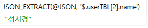

# 7.2.3 피벗과 JSON


## 피벗의 구현

> 피벗은 한 열에 포함된 여러 값을 출력하고, 이를 여러 열로 변환해 테이블 반환 식을 회전하고 필요하면 집계까지 수행하는 것을 말한다.


* 예제

  * 1단계

    ```mariadb
    USE sqlDB;
    CREATE TABLE pivotTest (uName CHAR(3), season CHAR(2), amount INT);
    ```

    

  * 2단계

    ```mariadb
    INSERT INTO pivottest VALUES ('김범수', '겨울', 10), ('윤종신', '여름', 15), ('김범수', '가을', 25), ('김범수', '봄', 3),
    ('김범수', '봄', 37), ('윤종신', '겨울', 40), ('김범수', '여름', 14), ('김범수', '겨울', 22), ('윤종신', '여름', 64);
    select * from pivottest;
    ```

    

  * 3단계

    ```mariadb
    SELECT uName,
    	   SUM(IF(SEASON=='봄', amount, 0)) AS '봄',
    	   SUM(IF(SEASON=='여름', amount, 0)) AS '여름',
    	   SUM(IF(SEASON=='가을', amount, 0)) AS '가을',
    	   SUM(IF(SEASON=='겨울', amount, 0)) AS '겨울',
    	   SUM(amount) AS '합계'
    	   FROM pivottest GROUP BY uName;
    ```

    


## JSON 데이터

> JSON은 현대 웹과 모바일 응용프로그램 등과 데이터를 교환하기 위한 개방형 표준 포맷을 말하는데, 속성과 키값으로 쌍을 이루며 구성된다. 

* JSON 데이터 예

  ```json
  {    
      "아이디" : "BBK",
      "이름" : "비비킴",
      "생년" : 1973,
      "지역" : "서울",
      "국번" : "010",
      "전화번호" : "00000000",
      "키" : 178,
      "가입일" : "2013.5.5"
  }
  ```

  

* 예제 : JSON 데이터로 바꾸는 방법

  ```mariadb
  USE sqlDB;
  SELECT JSON_OBJECT('name', NAME, 'height', height) AS 'JSON 값'
  	FROM usertbl WHERE HEIGHT>=180;
  ```

  

* JSON 관련 함수 사용법

  ```mariadb
  SET @JSON = '{"userTBL":
  	[
  		{"name":"임재범","height":182},
  		{"name":"이승기","height":182},
  		{"name":"성시경","height":186}
  	]
  	}' ;
  SELECT JSON_VALID(@JSON);
  SELECT JSON_search(@JSON, 'one', '성시경');
  SELECT JSON_EXTRACT(@JSON, '$.userTBL[2].name');
  SELECT JSON_INSERT(@JSON, '$.userTBL[0].mDate', '2009-09-09');
  SELECT JSON_REPLACE(@JSON, '$.userTBL[0].name', '홍길동');
  SELECT JSON_REMOVE(@JSON, '$.userTBL[0]');
  ```

  * `JSON_VALID()` : JSON 형식을 만족하면 1을, 아니면 0을 반환한다.

    

  * `JSON_SEARCH()` : 세 번째 파라미터에 주어진 문자열의 위치를 반환한다. 두번째 파라미터는 `'one'` 또는 `'all'`중 하나가 오는데 `'one'`은 처음으로 매치되는 하나만 반환하면 `'all'`은 매치되는 모든 것을 반환한다.

    

  * `JSON_EXTRACT()`는 `JSON_SEARCH()`와 반대로 지정된 위치의 값을 추출한다.

    

  * `JSON_INSERT()`는 새로운 값을 추가한다.

    

  * `JSON_REPLACE()`는 값을 변경한다.

    
  
  * `JSON_REMOVE()`는 지정된 항목을 삭제한다.
  
    
  
    
  
    
  