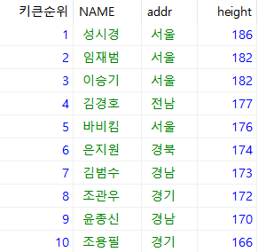
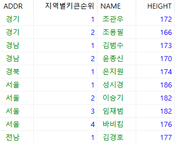
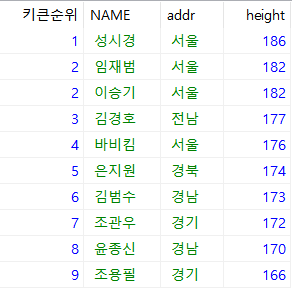
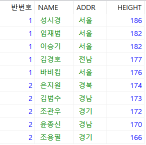

# 7.2.2 윈도우 함수(1)

> 행과 행 사이의 관계를 쉽게 정의하기 위해 제공되는 함수다. 윈도우 함수를 잘 활용하면 복잡한 SQL을 쉽게 활용할 수 있다. 쉽게 생각해 `OVER`절이 들어간 함수라고 보면 된다.


## 순위 함수

> `RANK()`, `NTILE()`, `DENSE_RANK()`, `ROW_NUMBER()` 등 4가지 순위를 표현하는 함수를 사용하면 상당히 유용하다. 순위 함수는 한마디로 결과에 순번 또는 등수를 매기는 역할을 하는 함수다.

* 형식

  ```mariadb
  <순위함수이름>( ) OVER(
  	[PARTITION BY <partition_by_list>]
      ORDER BY <order_by_list>)
  )
  ```

* 장점

  * 구문이 단순해 수정이 쉽다.
  * 효율성(성능)이 뛰어나다.

* 예시1

  ```mariadb
  USE sqldb;
  SELECT row_number() over(
  	ORDER BY height DESC) AS '키큰순위', NAME , addr, height FROM usertbl;
  ```

  

  * 키큰순위를 보면 순서가 정렬되어 있다.
  *  이름을 가나다 순서로 추가로 정렬하려면 `ORDER BY` 에 `NAME` 조건을 추가하면 된다.

* 예시2 : 전체 순위가 아닌 각 지역별로 순위를 주고 싶은 경우에는 `PARTITION BY`절을 사용하면 된다.

  ```mariadb
  SELECT ADDR, ROW_NUMBER() OVER(PARTITION BY ADDR ORDER BY HEIGHT DESC, NAME) AS '지역별키큰순위', NAME, HEIGHT FROM usertbl;
  ```

  

* 예시3 : 동일한 값을 동일한 등수로 처리할 경우는 `DENSE_RANK()`를 사용해 처리하면 된다. 그러나 예를 들어 2등이 2명이면 이 두명 다음의 순위는 3등이 되버린다.

  ```mariadb
  SELECT DENSE_RANK() OVER (ORDER BY HEIGHT DESC) AS '키큰순위', NAME, addr, height FROM usertbl;
  ```

  

* 예시4 : `RANK()`를 사용하면 위의 예제에서 중복순위 다음의 순위에 대해서 처리가 가능하다.

  ```mariadb
  SELECT RANK() OVER (ORDER BY HEIGHT DESC) AS '키큰순위', NAME, ADDR, HEIGHT FROM usertbl;
  ```

  

* 예시5 : 이번에는 전체 인원을 순서대로 세운다음 그룹으로 나누는 방법이다. `NTILE()`함수를 사용하면 된다.

  ```mariadb
  SELECT NTILE(2) OVER(ORDER BY HEIGHT DESC) AS '반번호', NAME, ADDR, HEIGHT FROM usertbl;
  ```

  
