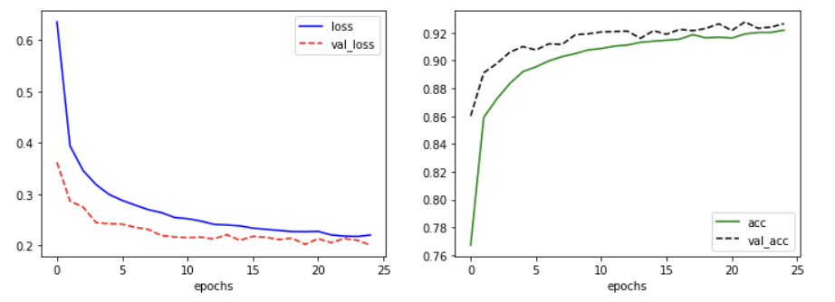

# VGG-19

> TF2로 VGG-19를 구성해 Fashion-mnist 문제를 해결해 본다. 


### Data 불러오기

```python
import tensorflow as tf

fashion_mnist = tf.keras.datasets.fashion_mnist
(train_x, train_y), (test_x, test_y) = fashion_mnist.load_data()
```

* `keras`안에 `datasets`에 이름 별로 데이터들이 존재한다.

* `fashion_mnist` 객체를 만들어 두고 `load_data()`로 train data및 test_data를 불러온다.


### rescaling 

```python
train_x = train_x/255.
test_x = test_x/255. 
train_x = train_x.reshape(-1, 28, 28, 1)
test_x = test_x.reshape(-1, 28, 28, 1)
```

* `255.0`로 나눠주어 min_max_scaling을 해준다.

* `reshape`을 통해 채널을 만들어 준다.


### model 작성
```python
import tensorflow as tf
from tensorflow.keras import Sequential
from tensorflow.keras.layers import Dense, Flatten, Conv2D, MaxPool2D, Dropout
from tensorflow.keras.optimizers import Adam

model = Sequential()
model.add(Conv2D(input_shape=(28, 28, 1), kernel_size=(3, 3), filters= 32, activation='relu', padding='same' ))
model.add(MaxPool2D(pool_size=(2, 2)))
model.add(Dropout(rate=0.5))
model.add(Conv2D(kernel_size=(3, 3), filters= 128, activation='relu', padding='same'))
model.add(Conv2D(kernel_size=(3, 3), filters= 256, activation='relu', padding='valid'))
model.add(MaxPool2D(pool_size=(2, 2)))
model.add(Dropout(rate=0.5))
model.add(Flatten())
model.add(Dense(units=512, activation='relu'))
model.add(Dropout(rate=0.5))
model.add(Dense(units=256, activation='relu'))
model.add(Dropout(rate=0.5))
model.add(Dense(units=10, activation='softmax'))

model.compile(optimizer=Adam(), loss='sparse_categorical_crossentropy', metrics=['acc'])
model.summary()
```

```python
Model: "sequential_3"
_________________________________________________________________
Layer (type)                 Output Shape              Param #   
=================================================================
conv2d (Conv2D)              (None, 28, 28, 32)        320       
_________________________________________________________________
max_pooling2d (MaxPooling2D) (None, 14, 14, 32)        0         
_________________________________________________________________
dropout (Dropout)            (None, 14, 14, 32)        0         
_________________________________________________________________
conv2d_1 (Conv2D)            (None, 14, 14, 128)       36992     
_________________________________________________________________
conv2d_2 (Conv2D)            (None, 12, 12, 256)       295168    
_________________________________________________________________
max_pooling2d_1 (MaxPooling2 (None, 6, 6, 256)         0         
_________________________________________________________________
dropout_1 (Dropout)          (None, 6, 6, 256)         0         
_________________________________________________________________
flatten (Flatten)            (None, 9216)              0         
_________________________________________________________________
dense (Dense)                (None, 512)               4719104   
_________________________________________________________________
dropout_2 (Dropout)          (None, 512)               0         
_________________________________________________________________
dense_1 (Dense)              (None, 256)               131328    
_________________________________________________________________
dropout_3 (Dropout)          (None, 256)               0         
_________________________________________________________________
dense_2 (Dense)              (None, 10)                2570      
=================================================================
Total params: 5,185,482
Trainable params: 5,185,482
Non-trainable params: 0
_________________________________________________________________
```

* 네트워크가 깊어질 수록 64 →128→256→512로 2배씩 늘려간다. (코드에 실수가 있다. 나중에 수정하겠다.)

### 학습

```python
history = model.fit(train_x, train_y, epochs=25, batch_size=50 ,validation_split=0.25)
```

```python
Epoch 1/25
900/900 [==============================] - 12s 6ms/step - loss: 0.9217 - acc: 0.6586 - val_loss: 0.3620 - val_acc: 0.8601
Epoch 2/25
900/900 [==============================] - 5s 6ms/step - loss: 0.4114 - acc: 0.8538 - val_loss: 0.2862 - val_acc: 0.8911
Epoch 3/25
900/900 [==============================] - 5s 6ms/step - loss: 0.3535 - acc: 0.8678 - val_loss: 0.2748 - val_acc: 0.8978
Epoch 4/25
900/900 [==============================] - 5s 6ms/step - loss: 0.3233 - acc: 0.8804 - val_loss: 0.2444 - val_acc: 0.9060
Epoch 5/25
900/900 [==============================] - 5s 6ms/step - loss: 0.3001 - acc: 0.8926 - val_loss: 0.2424 - val_acc: 0.9100
Epoch 6/25
900/900 [==============================] - 5s 6ms/step - loss: 0.2893 - acc: 0.8930 - val_loss: 0.2414 - val_acc: 0.9076
Epoch 7/25
900/900 [==============================] - 5s 6ms/step - loss: 0.2774 - acc: 0.9000 - val_loss: 0.2352 - val_acc: 0.9120
Epoch 8/25
900/900 [==============================] - 5s 6ms/step - loss: 0.2670 - acc: 0.9043 - val_loss: 0.2311 - val_acc: 0.9115
Epoch 9/25
900/900 [==============================] - 5s 6ms/step - loss: 0.2564 - acc: 0.9073 - val_loss: 0.2191 - val_acc: 0.9185
Epoch 10/25
900/900 [==============================] - 5s 6ms/step - loss: 0.2507 - acc: 0.9083 - val_loss: 0.2166 - val_acc: 0.9192
Epoch 11/25
900/900 [==============================] - 5s 6ms/step - loss: 0.2568 - acc: 0.9056 - val_loss: 0.2147 - val_acc: 0.9205
Epoch 12/25
900/900 [==============================] - 5s 6ms/step - loss: 0.2417 - acc: 0.9111 - val_loss: 0.2160 - val_acc: 0.9209
Epoch 13/25
900/900 [==============================] - 5s 6ms/step - loss: 0.2355 - acc: 0.9135 - val_loss: 0.2126 - val_acc: 0.9211
Epoch 14/25
900/900 [==============================] - 5s 6ms/step - loss: 0.2382 - acc: 0.9129 - val_loss: 0.2209 - val_acc: 0.9159
Epoch 15/25
900/900 [==============================] - 5s 6ms/step - loss: 0.2353 - acc: 0.9149 - val_loss: 0.2099 - val_acc: 0.9215
Epoch 16/25
900/900 [==============================] - 5s 6ms/step - loss: 0.2345 - acc: 0.9137 - val_loss: 0.2176 - val_acc: 0.9189
Epoch 17/25
900/900 [==============================] - 5s 6ms/step - loss: 0.2272 - acc: 0.9165 - val_loss: 0.2158 - val_acc: 0.9224
Epoch 18/25
900/900 [==============================] - 5s 6ms/step - loss: 0.2269 - acc: 0.9184 - val_loss: 0.2116 - val_acc: 0.9215
Epoch 19/25
900/900 [==============================] - 5s 6ms/step - loss: 0.2260 - acc: 0.9177 - val_loss: 0.2140 - val_acc: 0.9230
Epoch 20/25
900/900 [==============================] - 5s 6ms/step - loss: 0.2240 - acc: 0.9180 - val_loss: 0.2020 - val_acc: 0.9264
Epoch 21/25
900/900 [==============================] - 5s 6ms/step - loss: 0.2271 - acc: 0.9158 - val_loss: 0.2132 - val_acc: 0.9216
Epoch 22/25
900/900 [==============================] - 5s 6ms/step - loss: 0.2180 - acc: 0.9190 - val_loss: 0.2052 - val_acc: 0.9277
Epoch 23/25
900/900 [==============================] - 5s 6ms/step - loss: 0.2119 - acc: 0.9233 - val_loss: 0.2135 - val_acc: 0.9232
Epoch 24/25
900/900 [==============================] - 5s 6ms/step - loss: 0.2155 - acc: 0.9211 - val_loss: 0.2099 - val_acc: 0.9240
Epoch 25/25
900/900 [==============================] - 5s 6ms/step - loss: 0.2169 - acc: 0.9235 - val_loss: 0.2007 - val_acc: 0.9265
```


### 학습 결과
```python
import matplotlib.pyplot as plt

fig = plt.figure(figsize=(12,4))
plt.subplot(1, 2, 1)
plt.plot(history.history['loss'],'b-', label='loss')
plt.plot(history.history['val_loss'], 'r--', label='val_loss')
plt.xlabel('epochs')
plt.legend()


plt.subplot(1, 2, 2)
plt.plot(history.history['acc'], 'g-', label='acc')
plt.plot(history.history['val_acc'], 'k--', label='val_acc')
plt.xlabel('epochs')
plt.legend()

plt.show()
```



* 결과로 보면 overfitting이 일어나지 않았기 때문에 조금 더 학습했을 시 더 좋은 결과를 낳았을 것 같다.


### 테스트

```python
model.evaluate(test_x, test_y)
# 313/313 [==============================] - 1s 3ms/step - loss: 0.2270 - acc: 0.9198
# [0.22704067826271057, 0.9197999835014343]
```

* 0.9197 정도의 정확도가 나왔다.