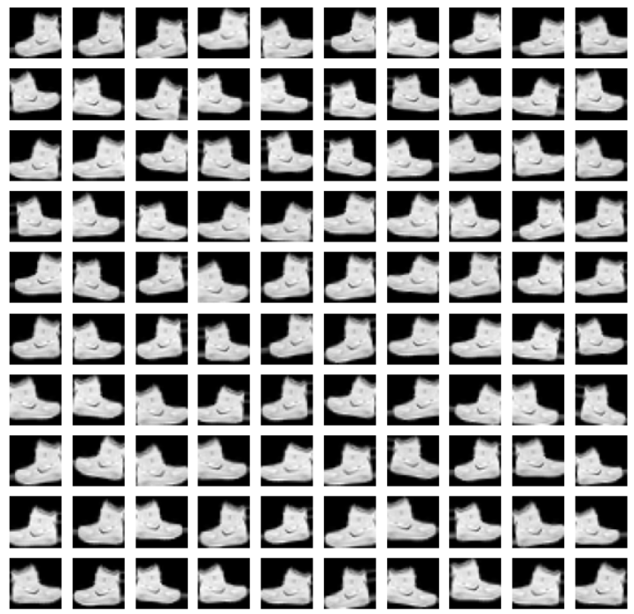
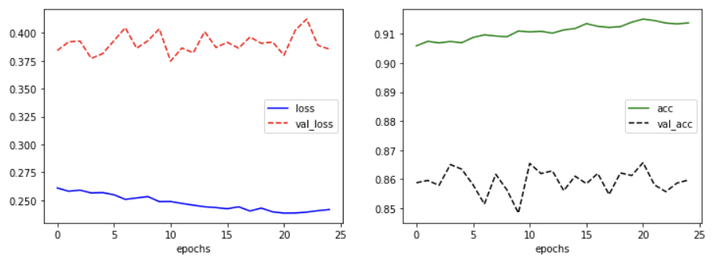

# Image Augmentation

> `flow`을 사용해 fashion_mnist에 대해서 간단히 Image Augmentation 후 **CNN**을 진행해 본다.


## 간단히 살펴보기

> 


### Data 불러오기 및 rescaling

```python
import tensorflow as tf

fashion_mnist = tf.keras.datasets.fashion_mnist
(train_x, train_y), (test_x, test_y) = fashion_mnist.load_data()

train_x = train_x/255.
test_x = test_x/255. 
train_x = train_x.reshape(-1, 28, 28, 1)
test_x = test_x.reshape(-1, 28, 28, 1)
```

* `keras`안에 `datasets`에 이름 별로 데이터들이 존재한다.

* `fashion_mnist` 객체를 만들어 두고 `load_data()`로 train data및 test_data를 불러온다.

* `255.0`로 나눠주어 min_max_scaling을 해준다.

* `reshape`을 통해 채널을 만들어 준다.


### 데이터 보강

```python
from tensorflow.keras.preprocessing.image import ImageDataGenerator
import numpy as np

image_generator  = ImageDataGenerator(
                    rotation_range=10,
                    zoom_range=0.1,
                    shear_range=0.5,
                    width_shift_range=0.1,
                    height_shift_range=0.1,
                    horizontal_flip=True,
                    vertical_flip=False)
augment_size = 100
x_augmented = image_generator.flow(np.tile(train_x[0].reshape(28*28), 100).reshape(-1,28,28,1), np.zeros(augment_size), batch_size=augment_size, shuffle=False).next()[0]
```

* np.tile(A, reps) : A를 reps에 정해진 형식만큼 반복한 값을 반환한다. 즉 `[A; A; ... A]` 형식으로 쌓이게 된다.
* `ImageDataGenerator`는 Iterator 객체를 만들고 객체에서 값을 순차적으로 만든다. 값을 꺼내는 방법은 next로 꺼낸다.

* `flow` 는 `train_dataset`, `train_label`, `batch_size`, `steps_per_epoch`, `epochs`, `validation_data`, `validation_steps`, `shuffle` 이 인자로 들어간다.


### 이미지 보강 이미지 살펴보기

```python
import matplotlib.pyplot as plt
fig = plt.figure(figsize=(10, 10))
for c in range(100):
    plt.subplot(10, 10, c+1)
    plt.axis('off')
    plt.imshow(x_augmented[c].reshape(28, 28), cmap='gray')
plt.show()
```




## fashion mnist 문제

> vgg19를 사용해 fashion mnist 문제를 해결한다.


### 이미지 보강
```python
import numpy as np

datagen = ImageDataGenerator(
            rotation_range=10,
            zoom_range=0.1,
            shear_range=0.5,
            width_shift_range=0.1,
            height_shift_range=0.1,
            horizontal_flip=True)

augment_size = 30000
randidx = np.random.randint(train_x.shape[0], size=augment_size)
x_augmented = train_x[randidx].copy()
y_augmented = train_y[randidx].copy()
x_augmented = datagen.flow(x_augmented, 
                           np.zeros(augment_size), 
                           batch_size=augment_size, 
                           shuffle=False).next()[0]

train_x = np.concatenate([train_x, x_augmented])
train_y = np.concatenate([train_y, y_augmented])
print(train_x.shape)
# (90000, 28, 28, 1)
```


### 모델 생성

```python
import tensorflow as tf
from tensorflow.keras import Sequential
from tensorflow.keras.layers import Dense, Flatten, Conv2D, MaxPool2D, Dropout
from tensorflow.keras.optimizers import Adam

model = Sequential()
model.add(Conv2D(input_shape=(28, 28, 1), kernel_size=(3, 3), filters= 32, activation='relu', padding='same' ))
model.add(MaxPool2D(pool_size=(2, 2)))
model.add(Dropout(rate=0.5))
model.add(Conv2D(kernel_size=(3, 3), filters= 128, activation='relu', padding='same'))
model.add(Conv2D(kernel_size=(3, 3), filters= 256, activation='relu', padding='valid'))
model.add(MaxPool2D(pool_size=(2, 2)))
model.add(Dropout(rate=0.5))
model.add(Flatten())
model.add(Dense(units=512, activation='relu'))
model.add(Dropout(rate=0.5))
model.add(Dense(units=256, activation='relu'))
model.add(Dropout(rate=0.5))
model.add(Dense(units=10, activation='softmax'))

model.compile(optimizer=Adam(), loss='sparse_categorical_crossentropy', metrics=['acc'])
model.summary()
```

```python
Model: "sequential"
_________________________________________________________________
Layer (type)                 Output Shape              Param #   
=================================================================
conv2d (Conv2D)              (None, 28, 28, 32)        320       
_________________________________________________________________
max_pooling2d (MaxPooling2D) (None, 14, 14, 32)        0         
_________________________________________________________________
dropout (Dropout)            (None, 14, 14, 32)        0         
_________________________________________________________________
conv2d_1 (Conv2D)            (None, 14, 14, 128)       36992     
_________________________________________________________________
conv2d_2 (Conv2D)            (None, 12, 12, 256)       295168    
_________________________________________________________________
max_pooling2d_1 (MaxPooling2 (None, 6, 6, 256)         0         
_________________________________________________________________
dropout_1 (Dropout)          (None, 6, 6, 256)         0         
_________________________________________________________________
flatten (Flatten)            (None, 9216)              0         
_________________________________________________________________
dense (Dense)                (None, 512)               4719104   
_________________________________________________________________
dropout_2 (Dropout)          (None, 512)               0         
_________________________________________________________________
dense_1 (Dense)              (None, 256)               131328    
_________________________________________________________________
dropout_3 (Dropout)          (None, 256)               0         
_________________________________________________________________
dense_2 (Dense)              (None, 10)                2570      
=================================================================
Total params: 5,185,482
Trainable params: 5,185,482
Non-trainable params: 0
_________________________________________________________________
```


### 학습

```python
history = model.fit(train_x, train_y, epochs=25, batch_size=50, validation_split=0.25)
```

```python
Epoch 1/25
1350/1350 [==============================] - 8s 6ms/step - loss: 0.2609 - acc: 0.9059 - val_loss: 0.3843 - val_acc: 0.8588
Epoch 2/25
1350/1350 [==============================] - 8s 6ms/step - loss: 0.2580 - acc: 0.9075 - val_loss: 0.3920 - val_acc: 0.8596
Epoch 3/25
1350/1350 [==============================] - 8s 6ms/step - loss: 0.2589 - acc: 0.9069 - val_loss: 0.3928 - val_acc: 0.8579
Epoch 4/25
1350/1350 [==============================] - 8s 6ms/step - loss: 0.2564 - acc: 0.9074 - val_loss: 0.3772 - val_acc: 0.8651
Epoch 5/25
1350/1350 [==============================] - 8s 6ms/step - loss: 0.2567 - acc: 0.9070 - val_loss: 0.3814 - val_acc: 0.8635
Epoch 6/25
1350/1350 [==============================] - 8s 6ms/step - loss: 0.2548 - acc: 0.9088 - val_loss: 0.3931 - val_acc: 0.8581
Epoch 7/25
1350/1350 [==============================] - 8s 6ms/step - loss: 0.2507 - acc: 0.9097 - val_loss: 0.4047 - val_acc: 0.8515
Epoch 8/25
1350/1350 [==============================] - 8s 6ms/step - loss: 0.2519 - acc: 0.9093 - val_loss: 0.3864 - val_acc: 0.8617
Epoch 9/25
1350/1350 [==============================] - 8s 6ms/step - loss: 0.2531 - acc: 0.9091 - val_loss: 0.3930 - val_acc: 0.8563
Epoch 10/25
1350/1350 [==============================] - 8s 6ms/step - loss: 0.2486 - acc: 0.9110 - val_loss: 0.4037 - val_acc: 0.8484
Epoch 11/25
1350/1350 [==============================] - 8s 6ms/step - loss: 0.2487 - acc: 0.9107 - val_loss: 0.3748 - val_acc: 0.8655
Epoch 12/25
1350/1350 [==============================] - 8s 6ms/step - loss: 0.2470 - acc: 0.9109 - val_loss: 0.3865 - val_acc: 0.8620
Epoch 13/25
1350/1350 [==============================] - 8s 6ms/step - loss: 0.2455 - acc: 0.9103 - val_loss: 0.3822 - val_acc: 0.8629
Epoch 14/25
1350/1350 [==============================] - 8s 6ms/step - loss: 0.2440 - acc: 0.9114 - val_loss: 0.4012 - val_acc: 0.8561
Epoch 15/25
1350/1350 [==============================] - 8s 6ms/step - loss: 0.2433 - acc: 0.9119 - val_loss: 0.3870 - val_acc: 0.8611
Epoch 16/25
1350/1350 [==============================] - 8s 6ms/step - loss: 0.2423 - acc: 0.9136 - val_loss: 0.3916 - val_acc: 0.8585
Epoch 17/25
1350/1350 [==============================] - 8s 6ms/step - loss: 0.2440 - acc: 0.9127 - val_loss: 0.3864 - val_acc: 0.8620
Epoch 18/25
1350/1350 [==============================] - 8s 6ms/step - loss: 0.2402 - acc: 0.9123 - val_loss: 0.3964 - val_acc: 0.8548
Epoch 19/25
1350/1350 [==============================] - 8s 6ms/step - loss: 0.2428 - acc: 0.9125 - val_loss: 0.3908 - val_acc: 0.8622
Epoch 20/25
1350/1350 [==============================] - 8s 6ms/step - loss: 0.2395 - acc: 0.9141 - val_loss: 0.3919 - val_acc: 0.8613
Epoch 21/25
1350/1350 [==============================] - 8s 6ms/step - loss: 0.2383 - acc: 0.9151 - val_loss: 0.3801 - val_acc: 0.8657
Epoch 22/25
1350/1350 [==============================] - 8s 6ms/step - loss: 0.2384 - acc: 0.9146 - val_loss: 0.4025 - val_acc: 0.8581
Epoch 23/25
1350/1350 [==============================] - 8s 6ms/step - loss: 0.2392 - acc: 0.9138 - val_loss: 0.4125 - val_acc: 0.8557
Epoch 24/25
1350/1350 [==============================] - 8s 6ms/step - loss: 0.2405 - acc: 0.9135 - val_loss: 0.3890 - val_acc: 0.8587
Epoch 25/25
1350/1350 [==============================] - 8s 6ms/step - loss: 0.2415 - acc: 0.9138 - val_loss: 0.3855 - val_acc: 0.8597
```


### train 결과
```python
import matplotlib.pyplot as plt
fig = plt.figure(figsize=(12,4))
plt.subplot(1,2,1)
plt.plot(history.history['loss'], 'b-', label='loss')
plt.plot(history.history['val_loss'], 'r--', label='val_loss')
plt.xlabel('epochs')
plt.legend()


plt.subplot(1,2,2)
plt.plot(history.history['acc'], 'g-', label='acc')
plt.plot(history.history['val_acc'], 'k--', label='val_acc')
plt.xlabel('epochs')
plt.legend()
plt.show()
```




### Test

```python
model.evaluate(test_x, test_y, verbose=1)
# 313/313 [==============================] - 1s 2ms/step - loss: 0.2249 - acc: 0.9190
# [0.22491860389709473, 0.9190000295639038]
```

* 이 경우에 오히려 Test set에 대해서 미세하게 정확도가 떨어졌다. (반면, 책에서는 미세하게 증가했다.)

* 조금 비효율적으로 데이터 증식을 해 train을 진행한것 같다. (예를 들어, `concatenate`를 사용해 억지로 데이터를 늘리고 `np.zeros` 같이 의미 없는 label을 넣었다.)
* 나중에 시간 날때 다시 증식을 진행해본다.