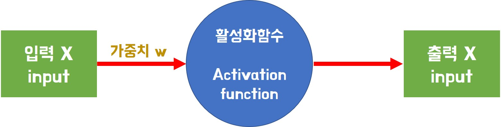
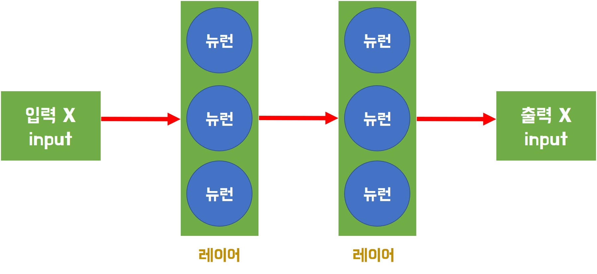

# Tensorflow 2.0 기초

> Tensorflow 2.0에 관한 기초에 관해 작성한다.


##  tf.random

> `tensorflow` 에서 난수를 만드는 함수 들의 집합이다.


* `tf.random.uniform` : 균일 분포에서 난수를 얻는다.

  ```python
  import tensorflow as tf
  rand1 = tf.random.uniform((1,), 0, 1)              
  print(rand1.numpy())
  # [0.10377657]
  
  
  rand2 = tf.random.uniform((2,1), 0,1) 
  print(rand2.numpy())
  # [[0.35903084]
  #  [0.5707301 ]]
  
  rand3 = tf.random.uniform([2,2], 0,1) 
  print(rand3.numpy())
  # [[0.41742373 0.5735997 ]
  #  [0.9300071  0.58794355]]
  
  print(rand3)
  # tf.Tensor(
  # [[0.41742373 0.5735997 ]
  #  [0.9300071  0.58794355]], shape=(2, 2), dtype=float32)
  ```
  
  * `tf.random.uniform`의 인자로는 출력값의 **shape**, 난수생성 범위의 **최댓값**과 **최솟값**을 지닌다. 
    * shape의 경우 `list`, `tuple` 모두 상관없지만 1차원 tuple로 만들때는 `,`를 빼먹지 말자.
  
* `tf.random.normal` : 정규분포에서 난수 생성한다.

  ```python
  rand = tf.random.normal((4,) , 0, 1)
  print(rand)
  # tf.Tensor([ 0.8983706  -0.8312778  -0.5730803   0.40051112], shape=(4,), dtype=float32)
  ```

  

  

## 뉴런, 레이어, 신경망

> 개념을 정리한다.

* 뉴런(퍼셉트론) : 입력을 받아서 계산 후 출력을 반환하는 단순한 구조이다.

  * 입력, 가중치, 활성화함수, 출력으로 구성된다.

    

* 레이어 : 뉴런이 여러개 모여 구성된다.

  

* 신경망 : 레이어가 다시 모여 구서된 형태이다.


## 간단한 XOR  회귀 문제

> TF2에 적응하기 위해 XOR 신경망 네트워크를 만들어 본다.


* 모델 작성 코드

  ```python
  import numpy as np
  import tensorflow as tf
  from tensorflow.keras.models import Sequential
  from tensorflow.keras.layers import Dense
  from tensorflow.keras.optimizers import SGD
  
  x = np.array([[1,1],[1,0],[0,1],[0,0]])
  y = np.array([[0], [1], [1], [0]])
  print(f'x shape:{x.shape}, y shape:{y.shape}') # x shape:(4, 2), y shape:(4, 1)
  
  model = Sequential()
  model.add(Dense(units=2, activation='sigmoid', input_shape=(2,)))
  model.add(Dense(units=1, activation='sigmoid'))
  
  model.compile(optimizer=SGD(lr=1e-1), loss='mse' ) 
  model.summary()
  ```

  * `from tensorflow.keras.models import Sequential` 대신 `from tensorflow.keras import Sequential` 을 사용할 수 있다.

  * `lr=1e-1` 대신 ` learning_rate=1e-1` 가능하다.
  * `y`의 `shape`을 1차원으로 잡아도 문제 없다.

  ```python
  Model: "sequential_2"
  _________________________________________________________________
  Layer (type)                 Output Shape              Param #   
  =================================================================
  dense_4 (Dense)              (None, 2)                 6         
  _________________________________________________________________
  dense_5 (Dense)              (None, 1)                 3         
  =================================================================
  Total params: 9
  Trainable params: 9
  Non-trainable params: 0
  _________________________________________________________________
  ```

  * 첫번째 layer에서 parameter 수를 보면 `x`의 `shape` 이 `(4, 2)` : (data 수, input 형태) 이고 `units =2`는 두개의 뉴런을 사용하기 때문에 input에 관한 weight의 개수가 2x2=4 개이고 bias가 2개가 필요하기 때문에 총 6개가 된다.

  * 마찬가지로 두번째 layer에서 parameter 수를 보면 output을 하나로 만들어 주도록 `units=1`이기고 이전 layer에서의 `output shape`이 2이기 때문에 2x1개의 weight와 1개의 bias가 필요하기 때문에 총 3개의 parameter가 된다.

* 학습

  ```python
  history = model.fit(x, y, epochs=2000, batch_size = 1)
  ```

  ```python
   Epoch 1/2000
  4/4 [==============================] - 0s 3ms/step - loss: 0.2366
  Epoch 2/2000
  4/4 [==============================] - 0s 4ms/step - loss: 0.2366
  Epoch 3/2000
  4/4 [==============================] - 0s 3ms/step - loss: 0.2365
  Epoch 4/2000
  4/4 [==============================] - 0s 4ms/step - loss: 0.2364
  Epoch 5/2000
  4/4 [==============================] - 0s 3ms/step - loss: 0.2363
  Epoch 6/2000
  4/4 [==============================] - 0s 4ms/step - loss: 0.2362
  Epoch 7/2000
  4/4 [==============================] - 0s 3ms/step - loss: 0.2361
  Epoch 8/2000
  4/4 [==============================] - 0s 3ms/step - loss: 0.2360
  Epoch 9/2000
  4/4 [==============================] - 0s 3ms/step - loss: 0.2359
  Epoch 10/2000
  4/4 [==============================] - 0s 3ms/step - loss: 0.2359
  
      ...
  
  Epoch 1990/2000
  4/4 [==============================] - 0s 3ms/step - loss: 0.0069
  Epoch 1991/2000
  4/4 [==============================] - 0s 4ms/step - loss: 0.0068
  Epoch 1992/2000
  4/4 [==============================] - 0s 4ms/step - loss: 0.0068
  Epoch 1993/2000
  4/4 [==============================] - 0s 4ms/step - loss: 0.0068
  Epoch 1994/2000
  4/4 [==============================] - 0s 4ms/step - loss: 0.0068
  Epoch 1995/2000
  4/4 [==============================] - 0s 4ms/step - loss: 0.0068
  Epoch 1996/2000
  4/4 [==============================] - 0s 4ms/step - loss: 0.0068
  Epoch 1997/2000
  4/4 [==============================] - 0s 4ms/step - loss: 0.0068
  Epoch 1998/2000
  4/4 [==============================] - 0s 4ms/step - loss: 0.0068
  Epoch 1999/2000
  4/4 [==============================] - 0s 4ms/step - loss: 0.0068
  Epoch 2000/2000
  4/4 [==============================] - 0s 4ms/step - loss: 0.0068
  ```

  * 책과 코드는 같지만 결과가 많이 다른것으로 보아 `epochs  `에 0이 하나 빠진것 같다.

* 결과 확인

  ```python
   model.predict(x)
  ```

  ```python
  array([[0.07255563],
         [0.9260882 ],
         [0.9030937 ],
         [0.08350924]], dtype=float32)
  ```

  * loss가 작은것으로 보아 train data에 대해서는 학습이 잘 됐기 대문에 train data에 대해서는 좋은 결과를 얻었다.

* `weight` 확인

  ```python
  for weight in model.weights:
      print(weight)
  ```

  ```python
  <tf.Variable 'dense_4/kernel:0' shape=(2, 2) dtype=float32, numpy=
  array([[ 4.554384 ,  4.984462 ],
         [-4.357217 , -5.1268845]], dtype=float32)>
  <tf.Variable 'dense_4/bias:0' shape=(2,) dtype=float32, numpy=array([ 2.1618018, -2.828243 ], dtype=float32)>
  <tf.Variable 'dense_5/kernel:0' shape=(2, 1) dtype=float32, numpy=
  array([[-6.270177 ],
         [ 6.6196933]], dtype=float32)>
  <tf.Variable 'dense_5/bias:0' shape=(1,) dtype=float32, numpy=array([2.8577993], dtype=float32)>
  ```

  * weight의 경우 `kernel`로 표현되고 bias는 `bias`로 표현된다.

    