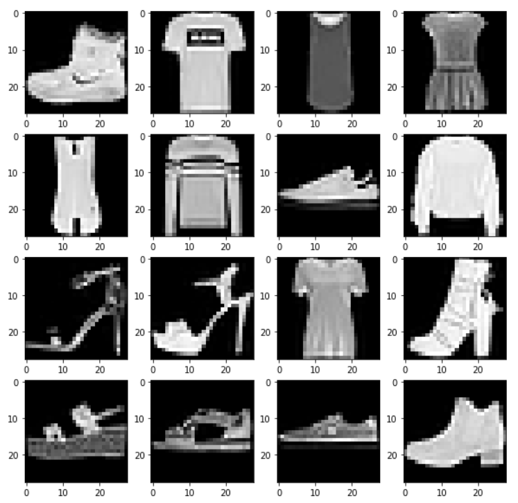
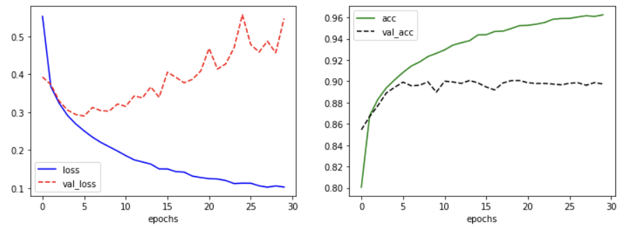

# 기본CNN(maxpooling 및 dropout layer)

> 기본 CNN에 maxpooling 및 dropout layer를 추가해본다.


### Data 불러오기 및 rescaling

```python
import tensorflow as tf

fashion_mnist = tf.keras.datasets.fashion_mnist
(train_x, train_y), (test_x, test_y) = fashion_mnist.load_data()

train_x = train_x/255.
test_x = test_x/255.

print(train_x.shape, test_x.shape)
# (60000, 28, 28) (10000, 28, 28)

train_x = train_x.reshape(-1,28,28,1)
test_x = test_x.reshape(-1,28,28,1)
```

* `keras`안에 `datasets`에 이름 별로 데이터들이 존재한다.

* `fashion_mnist` 객체를 만들어 두고 `load_data()`로 train data및 test_data를 불러온다.

* `255.0`로 나눠주어 min_max_scaling을 해준다.

* `reshape`을 통해 채널을 만들어 준다.


### 이미지 확인

```python
import matplotlib.pyplot as plt

fig = plt.figure(figsize=(10, 10))
for c in range(16):
    plt.subplot(4, 4, c+1)
    plt.imshow(train_x[c].reshape(28, 28), cmap='gray')
plt.show()
print(train_y[0:16]) # [9 0 0 3 0 2 7 2 5 5 0 9 5 5 7 9]
```




### model 작성

```python
import tensorflow as tf
from tensorflow.keras import Sequential
from tensorflow.keras.layers import Dense, Conv2D, Flatten, MaxPool2D, Dropout
from tensorflow.keras.optimizers import Adam

model = Sequential()
model.add(Conv2D(input_shape=(28,28,1), kernel_size = (3,3), filters=32))
model.add(MaxPool2D(strides=(2,2)))
model.add(Conv2D(kernel_size = (3,3), filters=64))
model.add(MaxPool2D(strides=(2,2)))
model.add(Conv2D(kernel_size = (3,3), filters=128))
model.add(Flatten())
model.add(Dense(units=128, activation='relu'))
model.add(Dropout(rate=0.3))
model.add(Dense(units=10, activation='softmax'))

model.compile(optimizer=Adam(), loss='sparse_categorical_crossentropy', metrics=['acc'])
model.summary()
```

* `Conv2D` layer의 주요 인수는 `kernel_size`, `strides`, `padding`, `filters` 네 가지이다.
  * `kernel_size` : 필터 행렬의 크기이다. 
  * `strides` : 한 스텝마다 이동하는 크기이다. 기본값은 `(1, 1)`이다.
  * `padding` : `same`은 빈 값을 0으로 채워 기존의 크기와 같게 만들어 준다. (zero padding)
  * `filters` : 필터의 개수이다.
* `MaxPool2D` layer의 주요 인수는 `pool_size`와 `strides`이다.
  * `pool_size`는 Max 연산을 수행할 범위이다.
  * `strides` : 한 스텝마다 이동하는 크기이다. 기본값은 `(1, 1)`이다.
* `Dropout` layer의 주요 인수는 `rate`로 제외할 뉴런의 비율을 나타낸다.

```python
Model: "sequential_4"
_________________________________________________________________
Layer (type)                 Output Shape              Param #   
=================================================================
conv2d_12 (Conv2D)           (None, 26, 26, 32)        320       
_________________________________________________________________
max_pooling2d_2 (MaxPooling2 (None, 13, 13, 32)        0         
_________________________________________________________________
conv2d_13 (Conv2D)           (None, 11, 11, 64)        18496     
_________________________________________________________________
max_pooling2d_3 (MaxPooling2 (None, 5, 5, 64)          0         
_________________________________________________________________
conv2d_14 (Conv2D)           (None, 3, 3, 128)         73856     
_________________________________________________________________
flatten_3 (Flatten)          (None, 1152)              0         
_________________________________________________________________
dense_6 (Dense)              (None, 128)               147584    
_________________________________________________________________
dropout_1 (Dropout)          (None, 128)               0         
_________________________________________________________________
dense_7 (Dense)              (None, 10)                1290      
=================================================================
Total params: 241,546
Trainable params: 241,546
Non-trainable params: 0
_________________________________________________________________
```


### 학습

```python
history = model.fit(train_x, train_y, epochs=30, batch_size = 50, validation_split=0.25)
```

```python
Epoch 1/30
900/900 [==============================] - 3s 3ms/step - loss: 0.7569 - acc: 0.7293 - val_loss: 0.3923 - val_acc: 0.8544
Epoch 2/30
900/900 [==============================] - 2s 3ms/step - loss: 0.3847 - acc: 0.8607 - val_loss: 0.3725 - val_acc: 0.8669
Epoch 3/30
900/900 [==============================] - 2s 3ms/step - loss: 0.3244 - acc: 0.8815 - val_loss: 0.3290 - val_acc: 0.8773
Epoch 4/30
900/900 [==============================] - 2s 3ms/step - loss: 0.2859 - acc: 0.8937 - val_loss: 0.3051 - val_acc: 0.8890
Epoch 5/30
900/900 [==============================] - 2s 3ms/step - loss: 0.2693 - acc: 0.9016 - val_loss: 0.2935 - val_acc: 0.8943
Epoch 6/30
900/900 [==============================] - 2s 3ms/step - loss: 0.2450 - acc: 0.9087 - val_loss: 0.2894 - val_acc: 0.8992
Epoch 7/30
900/900 [==============================] - 2s 3ms/step - loss: 0.2272 - acc: 0.9163 - val_loss: 0.3121 - val_acc: 0.8957
Epoch 8/30
900/900 [==============================] - 2s 3ms/step - loss: 0.2164 - acc: 0.9189 - val_loss: 0.3036 - val_acc: 0.8963
Epoch 9/30
900/900 [==============================] - 2s 3ms/step - loss: 0.2027 - acc: 0.9254 - val_loss: 0.3023 - val_acc: 0.8995
Epoch 10/30
900/900 [==============================] - 2s 3ms/step - loss: 0.1933 - acc: 0.9275 - val_loss: 0.3211 - val_acc: 0.8897
Epoch 11/30
900/900 [==============================] - 2s 3ms/step - loss: 0.1765 - acc: 0.9323 - val_loss: 0.3150 - val_acc: 0.9001
Epoch 12/30
900/900 [==============================] - 2s 3ms/step - loss: 0.1661 - acc: 0.9355 - val_loss: 0.3422 - val_acc: 0.8993
Epoch 13/30
900/900 [==============================] - 3s 3ms/step - loss: 0.1626 - acc: 0.9382 - val_loss: 0.3374 - val_acc: 0.8980
Epoch 14/30
900/900 [==============================] - 2s 3ms/step - loss: 0.1575 - acc: 0.9393 - val_loss: 0.3662 - val_acc: 0.9007
Epoch 15/30
900/900 [==============================] - 2s 3ms/step - loss: 0.1423 - acc: 0.9458 - val_loss: 0.3388 - val_acc: 0.8985
Epoch 16/30
900/900 [==============================] - 2s 3ms/step - loss: 0.1374 - acc: 0.9486 - val_loss: 0.4050 - val_acc: 0.8946
Epoch 17/30
900/900 [==============================] - 2s 3ms/step - loss: 0.1399 - acc: 0.9474 - val_loss: 0.3917 - val_acc: 0.8919
Epoch 18/30
900/900 [==============================] - 2s 3ms/step - loss: 0.1384 - acc: 0.9479 - val_loss: 0.3771 - val_acc: 0.8984
Epoch 19/30
900/900 [==============================] - 2s 3ms/step - loss: 0.1262 - acc: 0.9507 - val_loss: 0.3862 - val_acc: 0.9006
Epoch 20/30
900/900 [==============================] - 2s 3ms/step - loss: 0.1234 - acc: 0.9536 - val_loss: 0.4083 - val_acc: 0.9007
Epoch 21/30
900/900 [==============================] - 2s 3ms/step - loss: 0.1110 - acc: 0.9576 - val_loss: 0.4678 - val_acc: 0.8986
Epoch 22/30
900/900 [==============================] - 2s 3ms/step - loss: 0.1136 - acc: 0.9564 - val_loss: 0.4133 - val_acc: 0.8979
Epoch 23/30
900/900 [==============================] - 2s 3ms/step - loss: 0.1119 - acc: 0.9585 - val_loss: 0.4270 - val_acc: 0.8980
Epoch 24/30
900/900 [==============================] - 2s 3ms/step - loss: 0.1038 - acc: 0.9600 - val_loss: 0.4695 - val_acc: 0.8974
Epoch 25/30
900/900 [==============================] - 3s 3ms/step - loss: 0.1052 - acc: 0.9614 - val_loss: 0.5561 - val_acc: 0.8967
Epoch 26/30
900/900 [==============================] - 2s 3ms/step - loss: 0.1124 - acc: 0.9595 - val_loss: 0.4781 - val_acc: 0.8981
Epoch 27/30
900/900 [==============================] - 3s 3ms/step - loss: 0.0996 - acc: 0.9626 - val_loss: 0.4580 - val_acc: 0.8986
Epoch 28/30
900/900 [==============================] - 3s 3ms/step - loss: 0.0941 - acc: 0.9643 - val_loss: 0.4868 - val_acc: 0.8963
Epoch 29/30
900/900 [==============================] - 3s 3ms/step - loss: 0.1040 - acc: 0.9615 - val_loss: 0.4563 - val_acc: 0.8987
Epoch 30/30
900/900 [==============================] - 3s 3ms/step - loss: 0.0965 - acc: 0.9639 - val_loss: 0.5465 - val_acc: 0.8975
```


### 학습 결과

```python
import matplotlib.pyplot as plt
fig = plt.figure(figsize=(12,4))
plt.subplot(1,2,1)
plt.plot(history.history['loss'], 'b-', label='loss')
plt.plot(history.history['val_loss'], 'r--', label='val_loss')
plt.xlabel('epochs')
plt.legend()


plt.subplot(1,2,2)
plt.plot(history.history['acc'], 'g-', label='acc')
plt.plot(history.history['val_acc'], 'k--', label='val_acc')
plt.xlabel('epochs')
plt.legend()
plt.show()
```




### 테스트

```python
model.evaluate(test_x, test_y, verbose=1)
# 313/313 [==============================] - 1s 2ms/step - loss: 0.5229 - acc: 0.8988
# [0.5229305624961853, 0.8988000154495239]
```

* 약 0.89 정도의 정확도가 나온다.