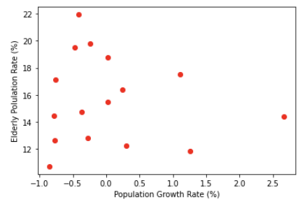
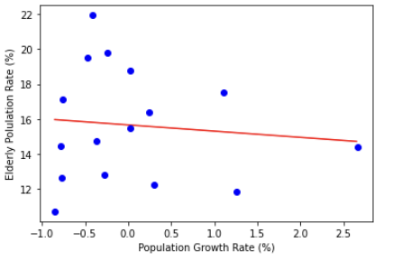
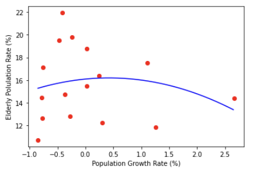

# 회귀
> tensorflow를 활용해 선형회귀와 다항회귀를 구현해본다. 


## 데이터

> 데이터는  '2018년 지역별 인구증가율과 고령인구비율'로 통계청 시각화자료에서 발췌되었다.  극단치는 제거되었다.

* 데이터

  ```python 
  import matplotlib.pyplot as plt
  
  X = [0.3, -0.78, 1.26, 0.03, 1.11, 0.24, -0.24, -0.47, -0.77, -0.37, -0.85, -0.41, -0.27, 0.02, -0.76, 2.66]
  Y = [12.27, 14.44, 11.87, 18.75, 17.52, 16.37, 19.78, 19.51, 12.65, 14.74, 10.72, 21.94, 12.83, 15.51, 17.14, 14.42]
  
  plt.plot(X,Y,'ro')
  plt.xlabel('Population Growth Rate (%)')
  plt.ylabel('Elderly Polulation Rate (%)')
  plt.show()
  ```




## 선형회귀

> 일반적으로 선형회귀는 최소제곱법을 이용하는 방법과 이용하지 않는 방법이 있다. 머신러닝 방법은 최소제곱법을 사용하지 않는 방법이다.


* 코드

  ```python
  import tensorflow as tf
  from tensorflow.keras.optimizers import Adam
  import numpy as np
  import matplotlib.pyplot as plt
  
  X = [0.3, -0.78, 1.26, 0.03, 1.11, 0.24, -0.24, -0.47, -0.77, -0.37, -0.85, -0.41, -0.27, 0.02, -0.76, 2.66]
  Y = [12.27, 14.44, 11.87, 18.75, 17.52, 16.37, 19.78, 19.51, 12.65, 14.74, 10.72, 21.94, 12.83, 15.51, 17.14, 14.42]
  
  a = tf.Variable(tf.random.uniform((1,), 0, 1))
  b = tf.Variable(tf.random.uniform((1,), 0, 1))
  
  def compute_loss():
      # y_pred는 X가 list임에도 불구하고 tf.Variable이 된다. 
      y_pred = a * X + b 
      
      loss = tf.reduce_mean((Y-y_pred)**2) # 제곱도 그냥 잘된다.
      return loss
  
  optimizer = Adam(lr=0.07)
  
  for i in range(10000):
      optimizer.minimize(compute_loss, var_list = [a, b]) 
      if i % 100 == 0:
          print(i, 'a:', a.numpy(), 'b:', b.numpy(), 'loss:', compute_loss().numpy())
  
  ```

  * ~~`from tensorflow.keras.optimizers` 대신 `tf.optimizers`를 사용해도 된다.~~ : 버전이 바뀌면서 안되는 듯 하다.
  * `y_pred`를 보면 일반 python `list`에 `tf.Variable`값을 곱하거나 더했는데 `list`가 `tf.Varaible`형태로 변하는것을 확인할 수 있다. 따라서 보통의 list라면 안되는 연산인 제곱 (`**2`)된다.
  * `optimizer.minimize(compute_loss, var_list = [a, b])`를 보면 우리의 custom `loss` 함수를 `labmda`함수 또는 일반 python 함수를 인자로 받는다. 또한 최소화 할 변수를 `list`로 인자를 넣어준다.

  ```python
  0 a: [0.33907124] b: [0.2712193] loss: 246.34442
  100 a: [0.12429434] b: [6.641011] loss: 91.10204
  200 a: [-0.1146976] b: [11.1330595] loss: 30.310709
  300 a: [-0.2545275] b: [13.7634115] loss: 13.404857
  400 a: [-0.32073662] b: [15.009015] loss: 10.215792
  500 a: [-0.34585693] b: [15.481615] loss: 9.815955
  600 a: [-0.35351628] b: [15.625717] loss: 9.7827
  700 a: [-0.35539708] b: [15.661099] loss: 9.78087
  800 a: [-0.35576782] b: [15.668076] loss: 9.780805
  900 a: [-0.35582632] b: [15.669171] loss: 9.780804
  1000 a: [-0.35583326] b: [15.669302] loss: 9.780804
  1100 a: [-0.35583323] b: [15.669302] loss: 9.780804
  1200 a: [-0.3558333] b: [15.669302] loss: 9.780804
  1300 a: [-0.35583317] b: [15.669302] loss: 9.780804
  1400 a: [-0.35583317] b: [15.669302] loss: 9.780804
  1500 a: [-0.35583317] b: [15.669302] loss: 9.780804
  1600 a: [-0.35583326] b: [15.669302] loss: 9.780804
  1700 a: [-0.35583323] b: [15.669303] loss: 9.780804
  1800 a: [-0.3558334] b: [15.669304] loss: 9.780804
  1900 a: [-0.35583326] b: [15.669305] loss: 9.780804
  2000 a: [-0.35583323] b: [15.669306] loss: 9.780804
  2100 a: [-0.35583338] b: [15.669306] loss: 9.780804
  2200 a: [-0.3558336] b: [15.669307] loss: 9.780804
  2300 a: [-0.35583353] b: [15.669308] loss: 9.780804
  2400 a: [-0.35583356] b: [15.669308] loss: 9.780804
  2500 a: [-0.35583338] b: [15.669309] loss: 9.780803
  2600 a: [-0.35583368] b: [15.669309] loss: 9.780804
  2700 a: [-0.3558333] b: [15.66931] loss: 9.780804
  2800 a: [-0.35583332] b: [15.669311] loss: 9.780804
  2900 a: [-0.35583383] b: [15.669311] loss: 9.780803
  3000 a: [-0.35583386] b: [15.669311] loss: 9.780803
  3100 a: [-0.35583386] b: [15.669312] loss: 9.780804
  3200 a: [-0.35583392] b: [15.669312] loss: 9.780804
  3300 a: [-0.3558334] b: [15.6693125] loss: 9.780804
  3400 a: [-0.35583368] b: [15.6693125] loss: 9.780804
  3500 a: [-0.35583335] b: [15.6693125] loss: 9.780804
  3600 a: [-0.35583413] b: [15.6693125] loss: 9.780804
  3700 a: [-0.35583118] b: [15.669313] loss: 9.780804
  3800 a: [-0.3572975] b: [15.669318] loss: 9.780806
  3900 a: [-0.3558337] b: [15.669318] loss: 9.780804
  4000 a: [-0.36303562] b: [15.669317] loss: 9.780846
  4100 a: [-0.35579008] b: [15.669317] loss: 9.780804
  4200 a: [-0.35579434] b: [15.669317] loss: 9.780804
  4300 a: [-0.35591018] b: [15.669317] loss: 9.780804
  4400 a: [-0.35583025] b: [15.669317] loss: 9.780804
  4500 a: [-0.35563916] b: [15.669317] loss: 9.780804
  4600 a: [-0.35583174] b: [15.669317] loss: 9.780803
  4700 a: [-0.35703257] b: [15.669317] loss: 9.780804
  4800 a: [-0.3558765] b: [15.669319] loss: 9.780805
  4900 a: [-0.35583317] b: [15.669319] loss: 9.780804
  5000 a: [-0.35539052] b: [15.669317] loss: 9.780806
  5100 a: [-0.35583106] b: [15.669317] loss: 9.780804
  5200 a: [-0.36191264] b: [15.669316] loss: 9.780834
  5300 a: [-0.3557862] b: [15.669317] loss: 9.780804
  5400 a: [-0.3558368] b: [15.669317] loss: 9.780804
  5500 a: [-0.35529917] b: [15.669318] loss: 9.780804
  5600 a: [-0.35583314] b: [15.669318] loss: 9.780805
  5700 a: [-0.3591106] b: [15.669316] loss: 9.780813
  5800 a: [-0.35582936] b: [15.669317] loss: 9.780804
  5900 a: [-0.35581598] b: [15.669317] loss: 9.780804
  6000 a: [-0.3560881] b: [15.669317] loss: 9.780805
  6100 a: [-0.35583597] b: [15.669317] loss: 9.780804
  6200 a: [-0.34739667] b: [15.669321] loss: 9.780863
  6300 a: [-0.35585672] b: [15.669318] loss: 9.780804
  6400 a: [-0.35583723] b: [15.669318] loss: 9.780804
  6500 a: [-0.35612795] b: [15.669318] loss: 9.780804
  6600 a: [-0.35583574] b: [15.669318] loss: 9.780804
  6700 a: [-0.3561583] b: [15.669318] loss: 9.780804
  6800 a: [-0.35576567] b: [15.669318] loss: 9.780804
  6900 a: [-0.35583997] b: [15.669318] loss: 9.780804
  7000 a: [-0.35605267] b: [15.669317] loss: 9.780804
  7100 a: [-0.35582763] b: [15.669317] loss: 9.780803
  7200 a: [-0.35636973] b: [15.669319] loss: 9.780804
  7300 a: [-0.35576412] b: [15.669317] loss: 9.780804
  7400 a: [-0.35583183] b: [15.669317] loss: 9.780804
  7500 a: [-0.353505] b: [15.669319] loss: 9.7808075
  7600 a: [-0.35581073] b: [15.669318] loss: 9.780804
  7700 a: [-0.354596] b: [15.669318] loss: 9.780806
  7800 a: [-0.35586235] b: [15.669318] loss: 9.780804
  7900 a: [-0.35584417] b: [15.669318] loss: 9.780804
  8000 a: [-0.35530794] b: [15.669318] loss: 9.780804
  8100 a: [-0.355844] b: [15.669318] loss: 9.780804
  8200 a: [-0.35985187] b: [15.669314] loss: 9.780817
  8300 a: [-0.35583457] b: [15.669318] loss: 9.780804
  8400 a: [-0.3557122] b: [15.669317] loss: 9.780805
  8500 a: [-0.35566613] b: [15.669317] loss: 9.780804
  8600 a: [-0.3558448] b: [15.669318] loss: 9.780805
  8700 a: [-0.35542977] b: [15.669318] loss: 9.780804
  8800 a: [-0.35582528] b: [15.669318] loss: 9.780804
  8900 a: [-0.35825703] b: [15.669315] loss: 9.780809
  9000 a: [-0.35585395] b: [15.669318] loss: 9.780804
  9100 a: [-0.35731357] b: [15.669315] loss: 9.780806
  9200 a: [-0.35585946] b: [15.669317] loss: 9.780804
  9300 a: [-0.35582528] b: [15.669317] loss: 9.780804
  9400 a: [-0.35533398] b: [15.669319] loss: 9.780805
  9500 a: [-0.35583892] b: [15.669318] loss: 9.780805
  9600 a: [-0.3484086] b: [15.669335] loss: 9.780849
  9700 a: [-0.35583892] b: [15.669317] loss: 9.780804
  9800 a: [-0.35583103] b: [15.669318] loss: 9.780804
  ```

  * loss가 떨어지는것을 보려면 `numpy()`를 사용해 값을 체크할 수 있다.

* 그래프로 결과 확인

  ```python
  line_x = np.arange(min(X), max(X), 0.01)
  line_y = a * line_x +b
  plt.plot(line_x, line_y, 'r-')
  plt.plot(X, Y, 'bo')
  plt.xlabel('Population Growth Rate (%)')
  plt.ylabel('Elderly Polulation Rate (%)')
  plt.show()
  ```

  


## 다항회귀

> 2차, 3차 함수를 사용한 회귀는 항만 늘어나기 때문에 2차함수로만 시도해본다.


* 코드

  ```python
  # 다항회귀 ax**2 + bx +c 로 해보자.
  import tensorflow as tf
  from tensorflow.keras.optimizers import Adam
  import numpy as np
  
  X = [0.3, -0.78, 1.26, 0.03, 1.11, 0.24, -0.24, -0.47, -0.77, -0.37, -0.85, -0.41, -0.27, 0.02, -0.76, 2.66]
  Y = [12.27, 14.44, 11.87, 18.75, 17.52, 16.37, 19.78, 19.51, 12.65, 14.74, 10.72, 21.94, 12.83, 15.51, 17.14, 14.42]
  
  a = tf.Variable(tf.random.uniform((1,), 0, 1))
  b = tf.Variable(tf.random.uniform((1,), 0, 1))
  c = tf.Variable(tf.random.uniform((1,), 0, 1))
  
  def compute_loss():
      
      y_pred = a * X*X + b * X + c
      loss = tf.reduce_mean((Y-y_pred)**2)
      return loss
  
  optimizer = Adam(lr=7e-2)
  
  for i in range(1000):
      optimizer.minimize(compute_loss, var_list = [a, b, c])
      if i%200 == 0:
          print(f'i:{i}, a:{a.numpy()}, b:{b.numpy()}, c:{c.numpy()}, loss:{compute_loss().numpy()}')
  ```

  ```python
  i:0, a:[0.39455694], b:[0.691105], c:[0.89703685], loss:219.9625244140625
  i:200, a:[2.6695685], b:[-4.412242], c:[10.551365], loss:29.686180114746094
  i:400, a:[0.26791796], b:[-0.785792], c:[14.678285], loss:10.785226821899414
  i:600, a:[-0.4384424], b:[0.2850077], c:[15.883442], loss:9.486658096313477
  i:800, a:[-0.55347115], b:[0.45937154], c:[16.079758], loss:9.45634937286377
  ```


* 결과 확인

  ```python
  import numpy as np
  import matplotlib.pyplot as plt
  x_line = np.arange(min(X), max(X), 0.01)
  y_line = a*x_line*x_line + b * x_line + c
  
  plt.plot(X, Y, 'ro') 
  plt.plot(x_line, y_line, '-b')
  
  plt.xlabel('Population Growth Rate (%)')
  plt.ylabel('Elderly Polulation Rate (%)')
  plt.show()
  ```

  